# **KS0523 4WD Mechanical Robot Arm Smart Car**

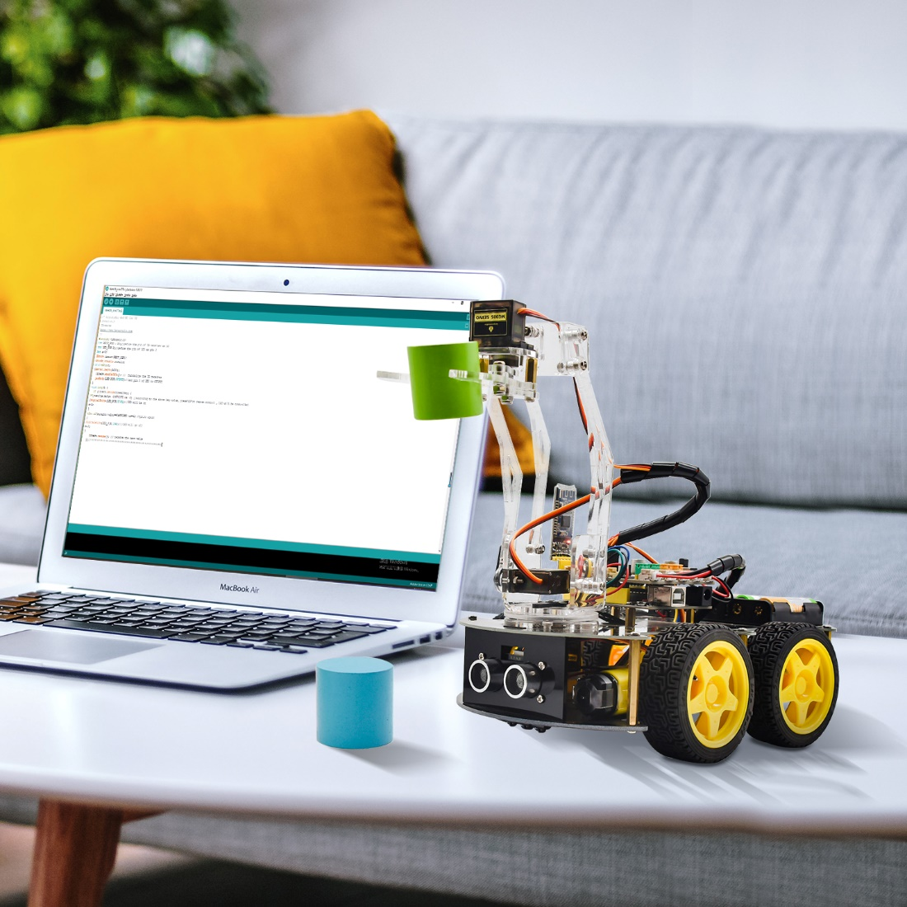

# Read me frist

 **Download the APP, Code and library from the link: <https://fs.keyestudio.com/KS0523>**

# Description

As science and technology develops by leaps and bounces, human society moves towards an era of intelligence and automation as well.

Our hands are weak and unresistant to ultra-cold and high temperature environment. In this regard, mechanical arms can totally supplant our hands and work for people.

At present, KEYES group has designed this kind of smart mechanical arm car to tackle the shortcomings of most robot arms, clumsy and fixed. This mechanical smart car reacts and performs its functions by following commands sent by the cellphone connected.

# Features

Multi-purpose Function: Anti-fall, obstacle avoidance, following, IR remote control, line tracking, automatically convey and so on.

Easy to Build: soldering circuit is not required.

High Tenacity: high performance car baseplate and metal mechanical arm

High Extension: expand other sensors and modules through motor driver shield.

Multiple Controls: IR remote control, fully automatic and App control(iOS and Android system)

Basic Programming：C language code learning.

# Specification

-   Working voltage: 5v

-   Input voltage: 7-12V

-   Maximum output current: 3A

-   Maximum power dissipation: 25W (T=75℃)

-   Motor speed: 5V 63 rpm / min

-   Motor drive form: TB6612 drive

-   Ultrasonic sensing angle: \<15 degrees

-   Ultrasonic detection distance: 2cm-400cm

-   Bluetooth remote control distance: 20-50 meters (measured)

-   Bluetooth APP control: support Android and iOS system

# Kit list

| NO.  |                         Name                         | QTY  |                           Picture                            |
| ---- | :--------------------------------------------------: | :--: | :----------------------------------------------------------: |
| 1    |                 Car Wheels 68*26mm                   |  4   |         |
| 2    |                  4.5V 200rpm Motor                   |  4   | 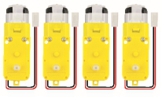        |
| 3    |         PCB Baseplate for 4WD Smart Car V2.0         |  1   | 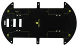        |
| 4    |                    4WD Top Board                     |  1   | 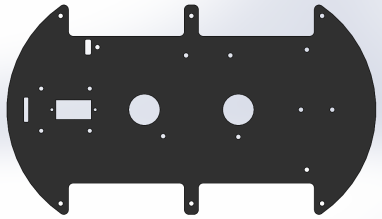        |
| 5    |                     Fixing Parts                     |  4   |         |
| 6    |        Quick Connectors Line Tracking Sensor         |  1   | 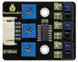        |
| 7    |          Quick Connectors Ultrasonic Sensor          |  1   |                  |
| 8    |   V4.0 Development Board (Compatible Arduino Uno)    |  1   | 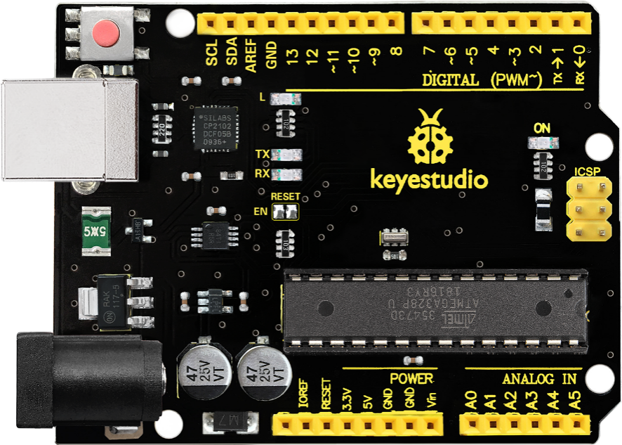        |
| 9    |              TB6612 Motor Driver Shield              |  1   | 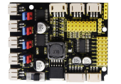        |
| 10   |            HM-10 Bluetooth-4.0 V3 Module             |  1   | 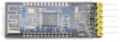        |
| 11   |             Quick Connectors IR Receiver             |  1   | 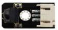        |
| 12   |                     M2+M3 Wrench                     |  1   |         |
| 13   |                  IR Remote Control                   |  1   |         |
| 14   |                 18650 Battery Holder                 |  1   | 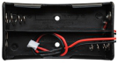        |
| 15   |               6-Slot AA Battery Holder               |  1   | 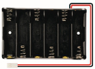        |
| 16   |                  AXK Plain Bearing                   |  1   | 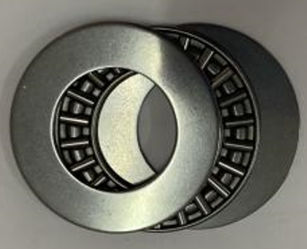        |
|      |                                                      |      |                                                        |
| 17   |  Bearing Cap （attached a yellow protective film）   |  1   | 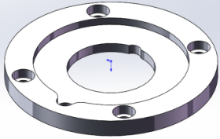        |
| 18   |         19Pcs Acrylic Robot Arm Parts T=3mm          |  1   | 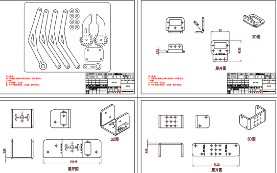        |
| 19   |             73*44MM Black Acrylic Board              |  1   |         |
| 20   | Dual-head JST-PH2.0MM-5P 24AWG Dupont Wire 15CM Lead |  1   | 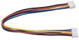        |
| 21   |                   MG90S 14G Servo                    |  3   | 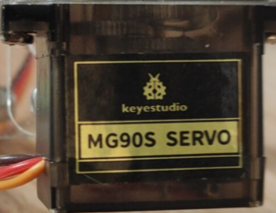        |
| 22   |    Dual-head JST-PH2.0MM-3P 24AWG 8CM Dupont Wire    |  1   | 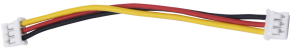        |
| 23   |        2.0*40MM Purple and Black Screwdriver         |  1   | 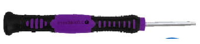        |
| 24   |                   8MM Winding Pipe                   |  1   | 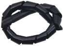        |
| 25   |            USB Cable AM/BM OD:5.0 L=50cm             |  1   | 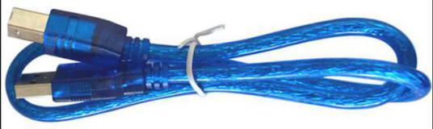       |
| 26   |                M3 Nickel Plated Nuts                 |  21  |                  |
| 27   |              M3*30MM Round Head Screws               |  8   |                  |
| 28   |              M3*6MM Round Head Screws                |  38  | 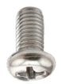        |
| 29   |          Dual-pass M3*40MM Hex Copper Bush           |  6   | 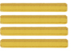                 |
| 30   |              M3*8MM Round Head Screws                |  6   | 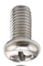        |
| 31   |          Dual-pass M3*10MM Hex Copper Bush           |  4   | 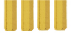                 |
| 32   |                 M3*10MM Flat Screws                  |  4   | 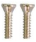                 |
| 33   |        M1.4X6 Self-tapping Round Head Screws         |  6   | 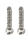                 |
| 34   |              M2*10MM Round Head Screws               |  8   |                                                        |
| 35   |                M2 Nickel Plated Nuts                 |  6   | 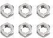       |
| 36   |              M3*10MM Round Head Screws               |  8   | 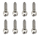                 |
| 37   |              M3*12MM Round Head Screws               |  6   | 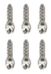                 |
| 38   |              M3*16MM Round Head Screws               |  2   | 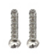                 |
| 39   |          M3 Nickel Plated Self-locking Nuts          |  14  | 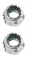                 |
| 40   |          Dual-pass M3*15MM Hex Copper Bush           |  2   | 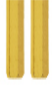                 |
| 41   |        M2*5MM Self-tapping Round Head Screws         |  4   | 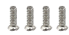                 |
| 42   |       M1.2*5MM Self-tapping Round Head Screws        |  4   | 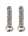                 |
| 43   |              20cm 3pin F-F Dupont Wire               |  2   |         |
| 44   |                    Red LED Module                    |  1   | 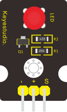        |
| 45   |   PH2.0mm-4P 24AWG 200MM Dupont Wire Eco-friendly    |  1   | 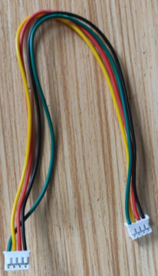        |
| 46   |          3*40MM Red and Black Screwdriver            |  1   |         |
| 47   |                 Black Ties 3*100MM                   |  6   |                                                        |
| 48   |                  Insulation Gasket                   |  4   | 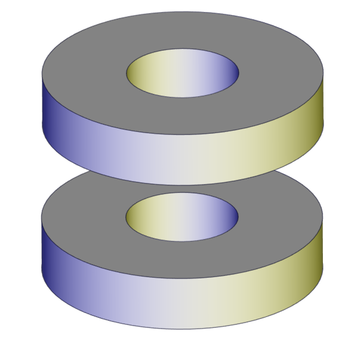        |
| 49   |             M2.5*12MM Round Head Screws              |  6   | 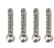                 |
| 50   |               M2.5 Nickel Plated Nuts                |  6   | 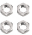                 |


# Getting Started with Arduino

**Installing Arduino IDE**

When we get control board, we need to download Arduino IDE and driver in the first place.

You can download Arduino IDE from the official website:

<https://www.arduino.cc/>, and click the **SOFTWARE \> DOWNLOADS**, as shown below:


There are many versions for Arduino software, and you only need to download the version suitable for system. Here, we will take WINDOWS system as an example to introduce how to download and install Arduino IDE.


There are two versions you can choose from, one is an installer which can be directly downloaded in computer; the other is a zip file which requires you to unzip and install it.


Just click“JUST DOWNLOAD”.

**KEYESTUDIO V4.0 Development Board**

You need to know that Keyestudio V4.0 development board is the core of this smart car.


Keyestudio V4.0 development board is an Arduino uno -compatible board, which is based on ATmega328P MCU, and with a cp2102 Chip as a UART-to-USB converter.

 
It has 14 digital input/output pins (of which 6 can be used as PWM outputs), 6 analog inputs, a 16 MHz quartz crystal, a USB connection, a power jack, 2 ICSP headers and a reset button.


It contains everything needed to support the microcontroller. Simply connect it to a computer with a USB cable or power it via an external DC power jack (DC 7-12V) or via female headers Vin/ GND(DC 7-12V) to get started.

| Microcontroller             | ATmega328P-PU                                            |
|-----------------------------|----------------------------------------------------------|
| Operating Voltage           | 5V                                                       |
| Input Voltage (recommended) | DC7-12V                                                  |
| Digital I/O Pins            | 14 (D0-D13) (of which 6 provide PWM output)              |
| PWM Digital I/O Pins        | 6 (D3, D5, D6, D9, D10, D11)                             |
| Analog Input Pins           | 6 (A0-A5)                                                |
| DC Current per I/O Pin      | 20 mA                                                    |
| DC Current for 3.3V Pin     | 50 mA                                                    |
| Flash Memory                | 32 KB (ATmega328P-PU) of which 0.5 KB used by bootloader |
| SRAM                        | 2 KB (ATmega328P-PU)                                     |
| EEPROM                      | 1 KB (ATmega328P-PU)                                     |
| Clock Speed                 | 16 MHz                                                   |
| LED_BUILTIN                 | D13                                                      |

**Installing Driver of V4.0 Board**

Let’s install the driver of V4.0 board. The USB-TTL chip on PLUS board adopts CP2102 serial chip. The driver program of this chip is included in Arduino 1.8 version and above, which is convenient.

if the version is not above 1.8, you need to download driver of CP2102 in the link:

<https://www.silabs.com/products/development-tools/software/usb-to-uart-bridge-vcp-drivers>)

When you attach USB port to computer, the driver of CP2102 can be installed.

If you install unsuccessfully, or intend to install manually, please open the device manager of computer. Right click Computer----- Properties----- Device Manager.


There is a yellow exclamation mark on the page, which implies the failure installation of the driver of CP2102.

Operate as follows；


Click “OK” to enter the following page and click “browse my computer for updated driver software”.


Click “Browse”, then search the driver of CP2102 and click “Next”.

There is a DRIVERS folder in Arduino software installed package（）, open driver folder and check the driver of CP210X series chips.


When opening the device manager, we will find the yellow exclamation mark disappear. The driver of CP2102 is installed successfully.


**Arduino IDE Setting**

Clickicon, and open Arduino IDE.


When downloading the sketch to the board, you must select the correct name of Arduino board that matches the board connected to your computer. As shown below;


Then select the correct COM port (you can see the corresponding COM port after the driver is successfully installed)


Before uploading the program to the board, let’s demonstrate the function of each symbol in the Arduino IDE toolbar.


A- Used to verify whether there is any compiling mistakes or not. 
B- Used to upload the sketch to your Arduino board. 
C- Used to create shortcut window of a new sketch. 
D- Used to directly open an example sketch. 
E- Used to save the sketch. 
F- Used to send the serial data received from board to the serial monitor.

**Start Your First Program**

Open the file to select **Example**, and click **BASIC**\>**BLINK**, as shown below:


Set board and COM port, the corresponding board and COM port are shown on the lower right of IDE.


Clickto start compiling the program, and check errors.


Clickto upload the program, upload successfully.

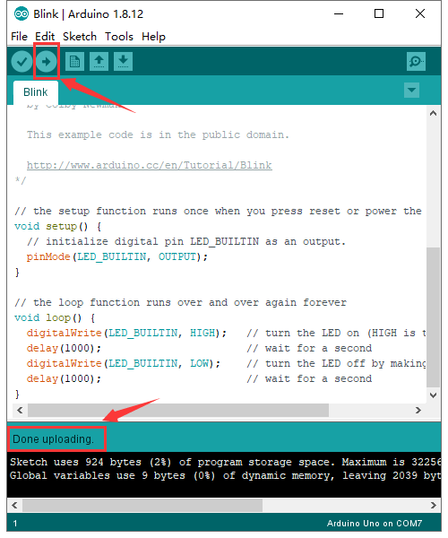

After the program is uploaded successfully, the onboard LED blinks.

**Add project Libraries**

**(1) What are Libraries ?**

[Libraries](https://www.arduino.cc/en/Reference/Libraries) are a collection of code that makes it easy for you to connect to a sensor,display, module, etc.

For example, the built-in LiquidCrystal library helps talk to LCD displays. There are hundreds of additional libraries available on the Internet for downloading.

The built-in libraries and some of these additional libraries are listed in the reference.

**(2) How to Install a Library ?**

Here we will introduce the most simple way for you to add libraries. 

**Step 1：** After downloading well the Arduino IDE, you can right-click the icon of Arduino IDE. 

Find the option "Open file location" shown as below:

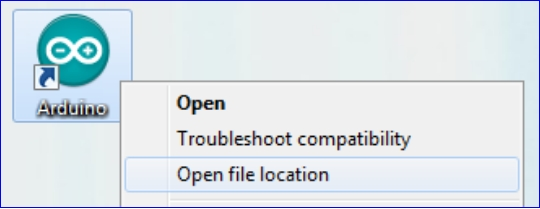

**Step 2:** Enter it to find out libraries folder, this folder is the library file of Arduino.


**Step 3：** Next to find out the“libraries”folder of robot arm car(seen in the link:https://fs.keyestudio.com/KS0523), you just need to replicate and paste it into the libraries folder of Arduino IDE.

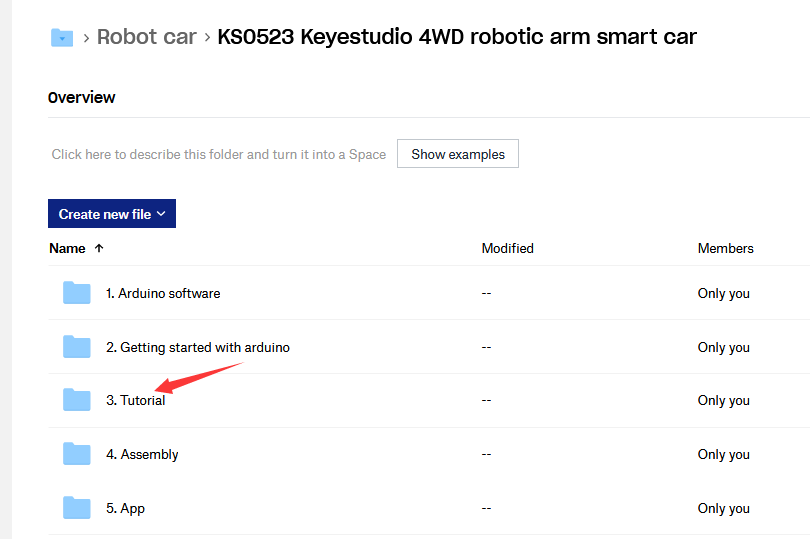

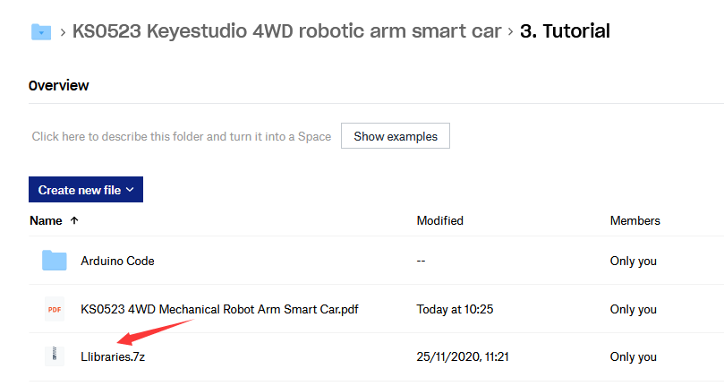

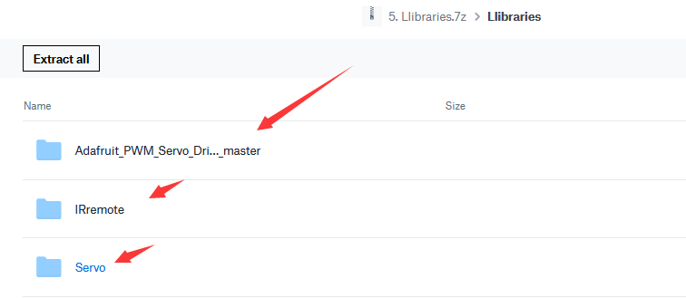

Download the above libraries and copy them in the libraries of Arduino.

Then the libraries of robot arm car are installed successfully, as shown below:

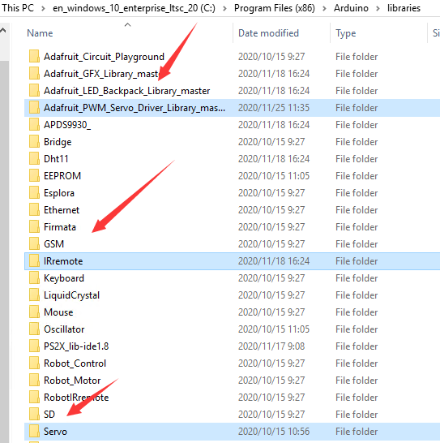

# Install Robot Arm Smart Car

**Note:** Peel the plastic film off the board first when installing the smart car.

Assemble Body

| Illustration                 |                             PIC                              |
| ---------------------------- | :----------------------------------------------------------: |
|                              |       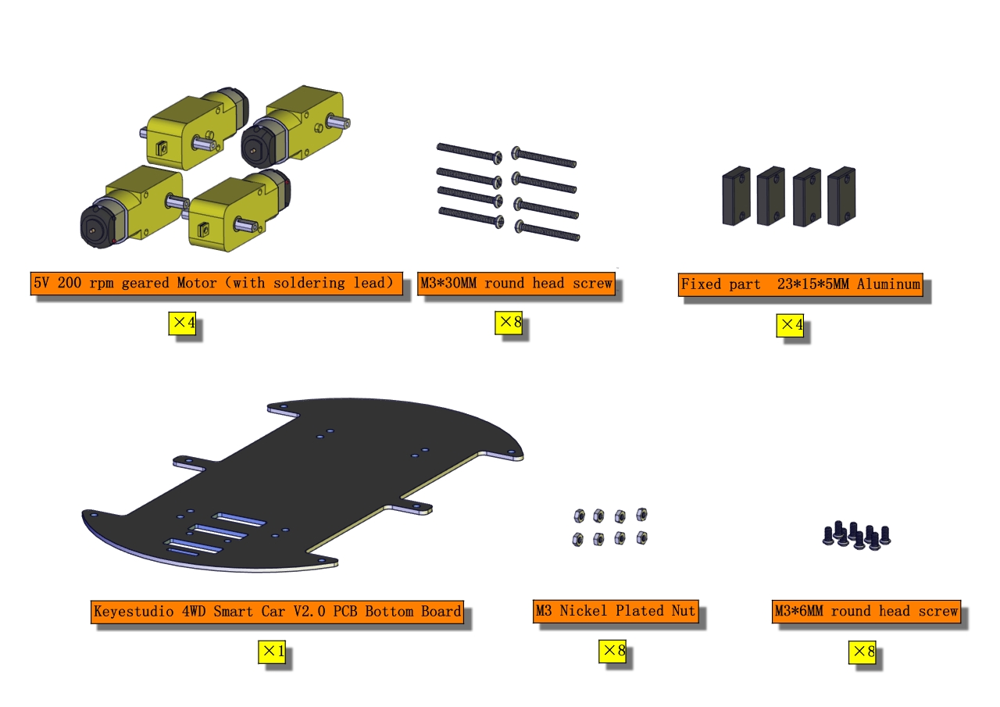       |
|                              |       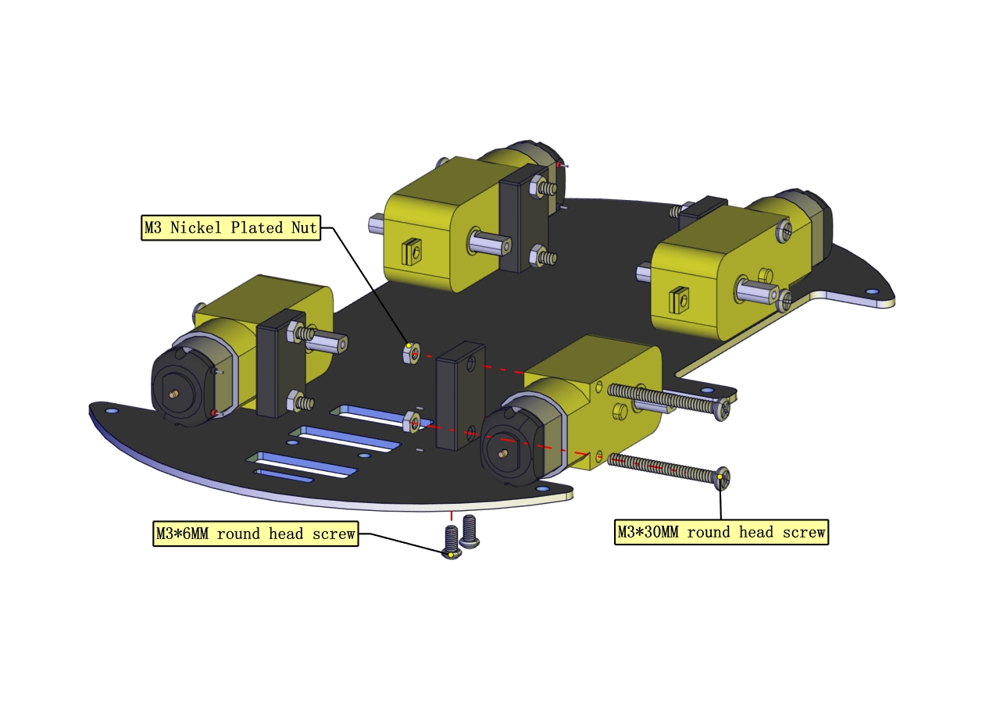       |
|                              |       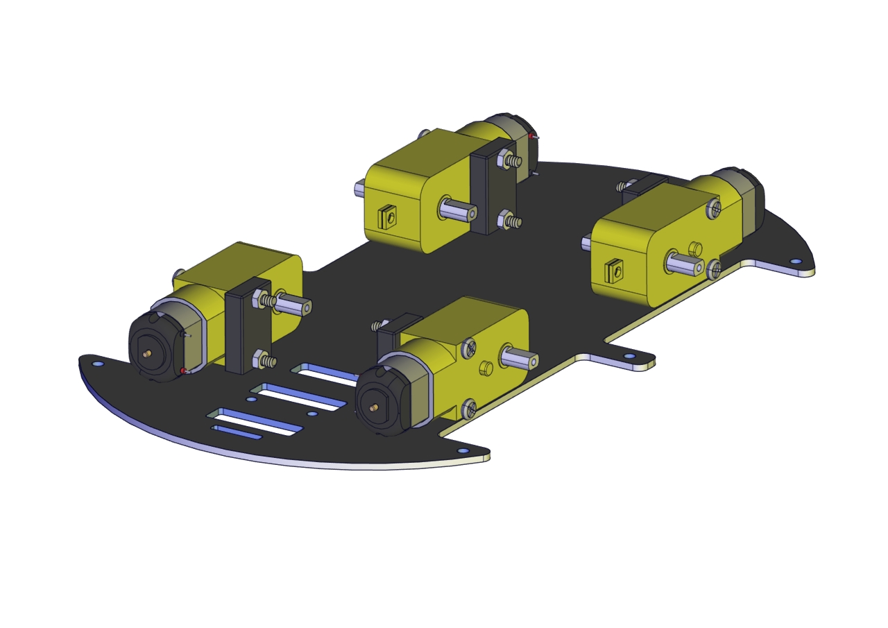       |
|                              |                                                              |
|                              |       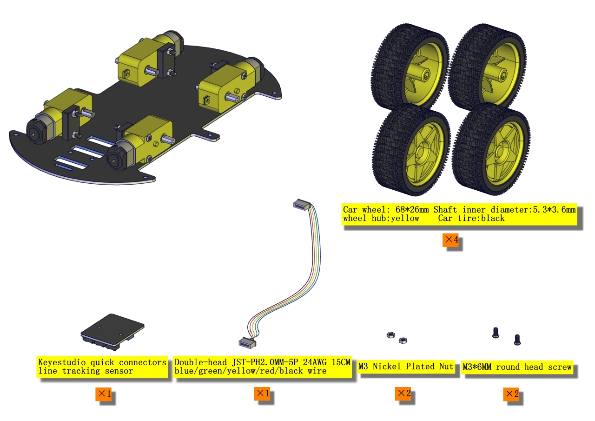       |
|                              |       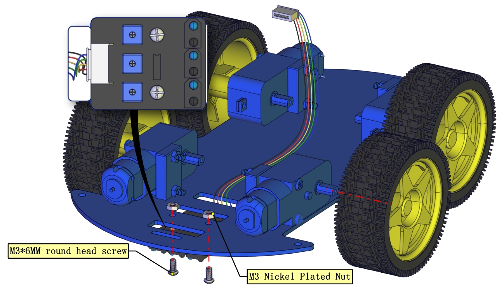       |
|                              |              |
|                              |                                                              |
|                              |              |
|                              |              |
|                              |              |
|                              |                                                              |
|                              |              |
|                              |              |
|                              |              |
|                              |              |
|                              |              |
|                              |     ****     |
|                              |                                                              |
| **This is servo 3**          |              |
|                              |              |
|                              |                                                              |
|                              |              |
|                              |              |
| Connect Ultrasonic Sensor    |  |
| Wire up Line Tracking Sensor |  |
| Connect Servo                |  |
| Wire up IR Receiver          |  |
| Install Front Motors         |  |
| Install Rear Motors          |  |
| Mount Battery Holder         |  |
|                              |              |
Assemble Robot Arms

The following code is used to initialize the angle value of servo. Copy the code in the Arduino IDE and plug in power, then three servos will rotate to an initial angle.

**Wiring Diagram**


**Note: servo 3 sits on the base**

**Test Code**

```c
#include <Servo.h>	
Servo myservo1;		//servo of claw
Servo myservo2;		//servo of arm
Servo myservo3;		//servo of base
int k1=90,k2=120,k3=90;  // initialize the angle value of three servos

void setup(){
  Serial.begin(9600); //set baud rate to 9600
  myservo1.attach(11);//Servo1 is connected to D11
  myservo2.attach(10);//Servo2 is linked with D10
  myservo3.attach(9);//Servo3 is linked with D9
  myservo1.write(k1);//make servo 1 rotate to 90°
  delay(1000);
  myservo2.write(k2);//make servo 1 rotate to 1200°
  delay(1000);
  myservo3.write(k3);//make servo 3 rotate to 90°
  delay(1000);
}
void loop(){
}
```

Installation

|     Illustration     |                             PIC                              |
| :------------------: | :----------------------------------------------------------: |
|                      |  |
|                      |  |
|                      |  |
|                      |                                                              |
|                      |  |
| Installed on servo 3 |  |
|                      |  |
|                      |                                                              |
|                      |  |
|  Mount with servo 2  |  |
|                      |  |
|                      |  |
|                      |                                                              |
|                      |  |
|                      | Don’t tighten nuts<br /><br />The angle between arm and car: 90° |
|                      |  |
|                      |  |
|                      | Don’t tighten nuts<br /> |
|                      |  |
|                      |                                                              |
|                      |  |
| **This is servo 1**  |  |
|                      |  |
|                      |  |
|                      |                                                              |
|                      |  |
|                      |  |
|                      |  |
|                      |                                                              |
|                      |  |
|                      | Don’t tighten nuts<br /> |
|                      |  |


# Projects

## Project 1: LED Light

**1. Description：**


For starters and enthusiasts, LED Blink is a fundamental program. LED, the abbreviation of light emitting diodes, consists of Ga, As, P, N chemical compounds and so on. The LED can flash in diverse color by altering the delay time in the test code. When in control, power on GND and VCC, the LED will be on if S end is in high level; nevertheless, it will go off.

**2. Specification：**


- Control interface: digital port 
- Working voltage: DC 3.3-5V 
- Pin spacing: 2.54mm 
- LED display color: red


**3. What You Need：**


**4. Wiring Diagram：**


The pin -, + and S of LED module are connected to G, V and D3 of shield.

**5. Test Code：**

```c
/*
 keyestudio 4wd Robot Arm Smart Car
 lesson 1.1
 Blink
 http://www.keyestudio.com
*/
void setup()
{
  pinMode(3, OUTPUT);// initialize digital pin 3 as an output.
}
void loop() // the loop function runs over and over again forever
{  
  digitalWrite(3, HIGH); // turn the LED on (HIGH is the voltage level)
  delay(1000); // wait for a second
  digitalWrite(3, LOW); // turn the LED off by making the voltage LOW
  delay(1000); // wait for a second
}
```

**6. Test Result：**

Upload the program, LED flashes with an interval of 1s.


**7. Code Explanation:**

**pinMode(ledPin，OUTPUT)** - This function denotes that the pin is INPUT or OUTPUT.

**digitalWrite(ledPin，HIGH)** - When pin is OUTPUT, we can set it to HIGH(output 5V) or LOW(output 0V)


**8. Extension Practice：**

We succeed in blinking the LED. Next, let’s observe what LED will change if we modify the delaying time.

```c
/*
 keyestudio 4WD Robot Arm Smart Car
 lesson 1.2
 delay
 http://www.keyestudio.com
*/
void setup() {  // initialize digital pin 11 as an output.
   pinMode(3, OUTPUT);
}
// the loop function runs over and over again forever
void loop()
 { digitalWrite(3, HIGH); // turn the LED on (HIGH is the voltage level)
   delay(100); // wait for 0.1 second
   digitalWrite(3, LOW); // turn the LED off by making the voltage LOW
   delay(100); // wait for 0.1 second
}//****************************************************************
```

The test result shows that the LED flashes faster. Therefore, we can draw a conclusion that pins and time delaying affect flash frequency.

## Project 2: Adjust LED Brightness

Description：

In previous lesson, we control LED on and off and make it blink.

In this project, we will control the brightness of LED through PWM to simulate breathing effects. Similarly, you can change the step length and delay time in the code so as to demonstrate different breathing effects.

PWM is a means of controlling the analog output via digital means. Digital control is used to generate square waves with different duty cycles (a signal that constantly switches between high and low levels) to control the analog output. In general, the input voltages of ports are 0V and 5V. What if the 3V is required? Or a switch among 1V, 3V and 3.5V? We cannot change resistors
constantly. For this reason, we resort to PWM.


For the Arduino digital port voltage output, there are only LOW and HIGH, which correspond to the voltage output of 0V and 5V. You can define LOW as 0 and HIGH as 1, and let the Arduino output five hundred 0 or 1 signals within 1 second.

If output five hundred 1, that is 5V; if all of which is 1, that is 0V. If output 010101010101 in this way then the output port is 2.5V, which is like showing movie. The movie we watch are not completely continuous. It actually outputs 25 pictures per second. In this case, the human can’t tell it, neither does PWM. If want different voltage, need to control the ratio of 0 and 1. The more 0,1 signals output per unit time, the more accurately control.


What You Need：


Wiring Diagram：


Test Code：

```c
/*
 keyestudio 4wdRobot Arm Smart Car
 lesson 2.1
 pwm
 http://www.keyestudio.com
*/
int ledPin = 3; // Define the LED pin at D3
int value;
void setup () {
  pinMode (ledPin, OUTPUT); // initialize ledpin as an output.
}
void loop () {
  for (value = 0; value <255; value = value + 1) {
    analogWrite (ledPin, value); // LED lights gradually light up
    delay (5); // delay 5MS
  }
  for (value = 255; value> 0; value = value-1) {
    analogWrite (ledPin, value); // LED gradually goes out
    delay (5); // delay 5MS
  }
}
```


Test Result：

After the program is uploaded successfully, the onboard LED blinks.


Code Explanation:

When we need to repeat some statements, we could use FOR statement.

FOR statement format is shown below:


FOR cyclic sequence:

Round 1：1 → 2 → 3 → 4

Round 2：2 → 3 → 4

…

Until number 2 is not established, “for”loop is over, after knowing this order, go back to code:

**for (int value = 0; value \< 255; value=value+1){****...}**

**for (int value = 255; value \>0; value=value-1){****...}**

The two“for”statements make value increase from 0 to 255, then reduce from 255 to 0, then increase to 255,....infinitely loop

There is a new function in the following ----- analogWrite()

We know that digital port only has two state of 0 and 1. So how to send an analog value to a digital value? Here,this function is needed. Let’s observe the Arduino board and find 6 pins marked“\~”which can output PWM signals.


Function format as follows:

**analogWrite(pin,value)**

analogWrite() is used to write an analog value from 0\~255 for PWM port, so the value is in the range of 0\~255. Attention that you only write the digital pins with PWM function, such as pin 3, 5, 6, 9, 10, 11.

PWM is a technology to obtain analog quantity through digital method. Digital control forms a square wave, and the square wave signal only has two states of turning on and off (that is, high or low levels). By controlling the ratio of the duration of turning on and off, a voltage varying from 0 to 5V can be simulated. The time turning on(academically referred to as high level) is called
pulse width, so PWM is also called pulse width modulation.   Through the following five square waves, let’s gain an insight to more about PWM.


In the above figure, the green line represents a period, and value of analogWrite() corresponds to a percentage which is called Duty Cycle as well. Duty cycle implies that high-level duration is divided by low-level duration in a cycle. From top to bottom, the duty cycle of first square wave is 0% and its corresponding value is 0. The LED brightness is lowest, that is, turn off. The more time high level lasts, the brighter the LED. Therefore, the last duty cycle is 100%, which correspond to 255, LED is brightest. And 25% means darker.

PWM mostly is used for adjusting the brightness of LED or rotation speed of motor.

It plays a vital role in controlling smart robot car. I believe that you can’t wait to enter the next project.


Extension Practice：

Let’s modify the value of the delaying time and remain the pin unchanged, then observe how LED changes.

```c
/*
 keyestudio 4wd Robot Arm Smart Car
 lesson 2.2
 pwm
 http://www.keyestudio.com
*/
int ledPin = 3; // Define the LED pin at D3
void setup(){
  pinMode (ledPin, OUTPUT); // initialize ledpin as an output.
}
void loop(){
  for (int value = 0; value <255; value = value + 1){
    analogWrite (ledPin, value); // LED lights gradually light up
    delay (30); // delay 30MS
  }
  for(int value=255; value>0;value=value-1){
    analogWrite (ledPin, value); // LED gradually goes out
    delay (30); // delay 30MS
  }
}//**********************************************************
```

Upload the code to development board, then LED blinks more slowly.


## Project 3: Servo Control

Description：

Servo motor is a position control rotary actuator. It mainly consists of a housing, circuit board, core-less motor, gear and position sensor. Its working principle is that the servo receives the signal sent by MCUs or receivers and produces a reference signal with a period of 20ms and width of 1.5ms, then compares the acquired DC bias voltage to the voltage of the potentiometer and
obtain the voltage difference output.

When the motor speed is constant, the potentiometer is driven to rotate through the cascade reduction gear, which leads that the voltage difference is 0, and the motor stops rotating. Generally, the angle range of servo rotation is 0°--180 °.

The rotation angle of servo motor is controlled by regulating the duty cycle of PWM (Pulse-Width Modulation) signal. The standard cycle of PWM signal is 20ms(50Hz). Theoretically, the width is distributed between 1ms-2ms, but in fact, it's between 0.5ms-2.5ms. The width corresponds the rotation angle from 0° to 180°. But note that for motors of different brands, the same signal may have different rotation angle.


In general, servo has three lines in brown, red and orange. The brown wire is grounded, the red one is a positive pole line and the orange one is a signal line.


The corresponding servo angles are shown below:

 
- Pulse width range: 500 → 2500 μsec 
- No-load speed: 0.12 ± 0.01 sec / 60 (DC 4.8V) 0.1 ± 0.01 sec / 60 (DC 6V) 
- No-load current: 200 ± 20mA (DC 4.8V) 220 ± 20mA (DC 6V) 
- Stopping torque: 1.3 ± 0.01kg · cm (DC 4.8V) 1.5 ± 0.1kg · cm (DC 6V) 
- Stop current: ≦ 850mA (DC 4.8V) ≦ 1000mA (DC 6V)
- Standby current: 3 ± 1mA (DC 4.8V) 4 ± 1mA (DC 6V)


What You Need：


Wiring Diagram：


Wiring note: the brown wire of servo is linked with GND(G), the red one is connected to V and the orange one is attached to S.

The servo has to be connected to external power due to its high demand for driving servo current. Generally, the current of development board is not big enough. If without connected power, the development board could be burnt.

Test Code1：

```c
/*
keyestudio 4wdRobot Arm Smart Car
lesson 3.1
Servo
http://www.keyestudio.com
*/
#define servoPin 9  //servo Pin
int pos; //angle variable of servo
int pulsewidth; ///pulsewidth variable of servo
void setup() {
  pinMode(servoPin, OUTPUT);  //set pins of servo to output
  procedure(0); //set angle of servo to 0°
}
void loop() {
  for (pos = 0; pos <= 180; pos += 1) { // goes from 0 degrees to 180 degrees
    // in steps of 1 degree
    procedure(pos);              // tell servo to go to position in variable 'pos'
    delay(15);                   //control the rotation speed of servo
  }
  for (pos = 180; pos >= 0; pos -= 1) { // goes from 180 degrees to 0 degrees
    procedure(pos);              // tell servo to go to position in variable 'pos'
    delay(15);                    
  }}
//Function to control servo
void procedure(int myangle) {
  pulsewidth = myangle * 11 + 500;  //Calculate pulsewidth value
  digitalWrite(servoPin,HIGH);
  delayMicroseconds(pulsewidth);   //the duration of high levle is pulsewidth
  digitalWrite(servoPin,LOW);
  delay((20 - pulsewidth / 1000));  //the period is 20ms, so the low level last for the rest of time
}//**********************************************************************************
```

Upload code successfully, servo swings forth and back in the range of 0° to 180°

There is another guide for restraining servo---- servo library file, the following link of official website is as for your reference.

<https://www.arduino.cc/en/Reference/Servo>

**Test Code2:**

```c
/*
 keyestudio 4wd Robot Arm Smart Car
 lesson 3.2
 servo
 http://www.keyestudio.com
*/
#include <Servo.h>
Servo myservo;  // create servo object to control a servo
// twelve servo objects can be created on most boards
int pos = 0;    // variable to store the servo position
void setup() {
  myservo.attach(9);  // attaches the servo on pin 9 to the servo object
}
void loop() {
  for (pos = 0; pos <= 180; pos += 1) { // goes from 0 degrees to 180 degrees
    // in steps of 1 degree
    myservo.write(pos);              // tell servo to go to position in variable 'pos'
    delay(15);                       // waits 15ms for the servo to reach the position
  }
  for (pos = 180; pos >= 0; pos -= 1) { // goes from 180 degrees to 0 degrees
    myservo.write(pos);              // tell servo to go to position in variable 'pos'
    delay(15);                       // waits 15ms for the servo to reach the position
  }}//**************************************************************************
```

**Test Result：**

Upload code successfully and power on, then servo swings in the range of 0° to 180°. The result is the same. We usually control it by library file.

Code Explanation:

Arduino comes with **\#include \<Servo.h\>** (servo function and statement）

The following are some common statements of the servo function: 

1\. **attach（interface）**——Set servo interface, port 9 and 10 are available

2\. **write（angle）**——The statement to set rotation angle of servo, the angle range is from 0° to 180° 

3\. **read（）**——used to read angle of servo, read the command value of“write()”

4\. **attached（）**——Judge if the parameter of servo is sent to its interface 

Note: The above written format is“servo variable name, specific statement（）”, for instance: myservo.attach(9)


## Project 4: Ultrasonic Ranging

Description：


The HC-SR04 ultrasonic sensor uses sonars to determine distance away from an object like bats do. It offers excellent non-contact range detection with high accuracy and stable readings in an easy-to-use package. It comes with an ultrasonic transmitter and a receiver module.

The HC-SR04 or the ultrasonic sensor is used in a wide range of electronics projects for creating obstacle detection and distance measuring as well as various other applications. Here we have brought the simple method to measure the distance with Arduino and ultrasonic sensor and how to use ultrasonic sensor with Arduino.

Specification：


- Power Supply :+5V DC

- Quiescent Current : \<2mA

- Working Current: 15mA

- Effectual Angle: \<15°

- Ranging Distance : 2cm – 400 cm

- Resolution : 0.3 cm

- Measuring Angle: 30 degree

- Trigger Input Pulse width: 10uS


What You Need：


**The principle of ultrasonic sensor**

As the above picture shown, it is like two eyes. One is transmitting end, the other is receiving end.

The ultrasonic module will emit the ultrasonic waves after triggering signals. When the ultrasonic waves encounter the object and are reflected back, the module outputs an echo signal, so it can determine the distance of object from the time gap between triggering the signal and echoing the signal.  

The t is the time that the emitting signal meets the obstacle and returns. And the propagation speed of sound in the air is about 343m/s, and **distance = speed\* time**. However, the ultrasonic wave emits and comes back, which is 2 times of distance. 

Therefore, it needs to be divided by 2, **the distance measured by ultrasonic wave = (speed \* time)/2**.

1.  Use method and timing chart of ultrasonic module:  Setting the delaying time of Trig pin of SR04 to 10μs at least, which can
    trigger it to detect distance. 
2.  After triggering, the module will automatically send eight 40KHz ultrasonic pulses and detect whether there is a signal return. This step will be completed automatically by the module. 
3.  If the signal returns, the Echo pin will output a high level, and the duration of the high level is the time from the transmission of the ultrasonic wave to the return.


Circuit diagram of ultrasonic sensor


Wiring Diagram


**Wiring Guide:**

Ultrasonic sensor keyestudio Sensor Shield

V → (V)

T → 12(S)

Echo → 13(S)

G → G(G)

Test Code：

```c
/*
 keyestudio 4wdRobot Arm Smart Car
 lesson 4.1
 Ultrasonic sensor
 http://www.keyestudio.com
*/ 
int trigPin = 12;    // Trigger
int echoPin = 13;    // Echo
long duration, cm, inches;
 void setup() {
  //Serial Port begin
  Serial.begin (9600);
  //Define inputs and outputs
  pinMode(trigPin, OUTPUT);
  pinMode(echoPin, INPUT);
}
void loop() {
  // The sensor is triggered by a HIGH pulse of 10 or more microseconds.
  // Give a short LOW pulse beforehand to ensure a clean HIGH pulse:
  digitalWrite(trigPin, LOW);
  delayMicroseconds(2);
  digitalWrite(trigPin, HIGH);
  delayMicroseconds(10);
  digitalWrite(trigPin, LOW);
   // Read the signal from the sensor: a HIGH pulse whose
  // duration is the time (in microseconds) from the sending
  // of the ping to the reception of its echo off of an object.
  duration = pulseIn(echoPin, HIGH);
   // Convert the time into a distance
  cm = (duration/2) / 29.1;     // Divide by 29.1 or multiply by 0.0343
  inches = (duration/2) / 74;   // Divide by 74 or multiply by 0.0135
    Serial.print(inches);
  Serial.print("in, ");
  Serial.print(cm);
  Serial.print("cm");
  Serial.println();
  delay(50);
}
//**************************************************************************
```

**Test Result：**

Upload test code on the development board, open serial monitor and set baud rate to 9600. The detected distance will be displayed, and the unit is cm and inch. Hindering the ultrasonic sensor by hand, you can view the displayed distance values get smaller.


**Code Explanation**

**int trigPin-** this pin is defined to transmit ultrasonic waves, generally output.

**int echoPin -** this is defined as the pin of reception, generally input

**cm = (duration/2) / 29.1-unit is cm**

**inches = (duration/2) / 74-unit is inch**

We can calculate the distance by using the following formula:

distance = (traveltime/2) x speed of sound

The speed of sound is: 343m/s = 0.0343 cm/uS = 1/29.1 cm/uS

Or in inches: 13503.9in/s = 0.0135in/uS = 1/74in/uS

We need to divide the traveltime by 2 because we have to take into account that the wave was sent, hit the object, and then returned back to the sensor.

**Extension Practice：**

We have just measured the distance displayed by the ultrasonic. How about controlling the LED with the measured distance? Let's try it and connect an LED module to the D3 pin.


```c
/*
 keyestudio 4wdRobot Arm Smart Car
 lesson 4.2
 Ultrasonic LED
 http://www.keyestudio.com
*/ 
int trigPin = 12;    // Trigger
int echoPin = 13;    // Echo
long duration, cm, inches;
void setup() {
  Serial.begin (9600);  //Serial Port begin
  pinMode(trigPin, OUTPUT);  //Define inputs and outputs
  pinMode(echoPin, INPUT);
  pinMode(3, OUTPUT);
}
 void loop() 
{
  // The sensor is triggered by a HIGH pulse of 10 or more microseconds.
  // Give a short LOW pulse beforehand to ensure a clean HIGH pulse:
  digitalWrite(trigPin, LOW);
  delayMicroseconds(2);
  digitalWrite(trigPin, HIGH);
  delayMicroseconds(10);
  digitalWrite(trigPin, LOW);
  // Read the signal from the sensor: a HIGH pulse whose
  // duration is the time (in microseconds) from the sending
  // of the ping to the reception of its echo off of an object.
  duration = pulseIn(echoPin, HIGH);
  // Convert the time into a distance
  cm = (duration/2) / 29.1;     // Divide by 29.1 or multiply by 0.0343
  inches = (duration/2) / 74;   // Divide by 74 or multiply by 0.0135
  Serial.print(inches);
  Serial.print("in, ");
  Serial.print(cm);
  Serial.print("cm");
  Serial.println();
  delay(50);
if (cm>=2 && cm<=10)digitalWrite(3, HIGH);
else digitalWrite(3, LOW);
}//****************************************************************
```

Upload test code to development board and put you hand away from the ultrasonic sensor for 2cm-10cm, then LED will be on.


## Project 5: Line Tracking Sensor

Description：


The tracking sensor is actually an infrared sensor. The component used here is the TCRT5000 infrared tube.

Its working principle is to use the different reflectivity of infrared light to the color, then convert the strength of the reflected signal into a current signal.

During the process of detection, black is active at HIGH level, but white is active at LOW level. The detection height is 0-3 cm.

Keyestudio 3-channel line tracking module has integrated 3 sets of TCRT5000 infrared tube on a single board, which is more convenient for wiring and control.

By rotating the adjustable potentiometer on the sensor, it can adjust the detection sensitivity of the sensor.

Specification：

- Operating Voltage: 3.3-5V (DC)

- Interface: 5PIN

- Output Signal: Digital signal

- Detection Height: 0-3 cm


Special note: before testing, turn the potentiometer on the sensor to adjust the detection sensitivity. When adjust the LED at the threshold between ON and OFF, the sensitivity is the best.

What You Need：


Wiring Diagram：


G and V of line tracking sensor are connected to G and V of shield, the rest pins are linked with D6, D7, D8 respectively.

Test Code：

```c
/*
 keyestudio 4wdRobot Arm Smart Car
 lesson 5.1
 Line Tracking sensor
 http://www.keyestudio.com
*/
#define SensorLeft    6   //input pin of left sensor
#define SensorMiddle  7   //input pin of middle sensor
#define SensorRight   8   //input pin of right sensor
unsigned char SL;        //state of left sensor
unsigned char SM;        //state of middle sensor
unsigned char SR;        //state of right sensor

void setup(){
//set baud rate to 9600
  Serial.begin(9600);
  //set to input mode
  pinMode(SensorLeft,INPUT);
  pinMode(SensorMiddle,INPUT);
  pinMode(SensorRight,INPUT);
}

void loop(){
//read the values of three line tracking sensors
  SL = digitalRead(SensorLeft);
  SM = digitalRead(SensorMiddle);
  SR = digitalRead(SensorRight);
//print the values of three sensors
  Serial.print("SL=");
  Serial.print(SL);
  Serial.print("SM=");
  Serial.print(SM);
  Serial.print("SR=");
  Serial.println(SR);
}
```


Test Result：

Upload the code on development board, open serial monitor to check line tracking sensors. And the displayed value is 1(high level) when no signals are received. The value becomes into 0 when covering sensor with paper.


Code Explanation:

**Serial.begin(9600)**- Initialize serial port and set baud rate to 9600

**pinMode-** Define the pin as an input or output mode

**digitalRead-** Read the state of pins, which are generally HIGH and LOW level


Extension Practice：

Connect an LED to D3, then we could control LED by line tracking sensor.


```c
/*
keyestudio 4WD Robot Arm Smart Car
lesson 5.2
 Line Track sensor
 http://www.keyestudio.com
*/
int L_pin = 6;  //pins of  left line tracking sensor
int M_pin = 7;  //pins of  middle line tracking sensor
int R_pin = 8;  //pins of  right  line tracking sensor
int val_L,val_R,val_M;// define the variables of three sensors 
void setup()
{
  Serial.begin(9600); // initialize serial communication at 9600 bits per second
  pinMode(L_pin,INPUT); // make the L_pin as an input
  pinMode(M_pin,INPUT); // make the M_pin as an input
  pinMode(R_pin,INPUT); // make the R_pin as an input
  pinMode(3, OUTPUT);
}
void loop() 
{ 
  val_L = digitalRead(L_pin);//read the L_pin:
  val_R = digitalRead(R_pin);//read the R_pin:
  val_M = digitalRead(M_pin);//read the M_pin:
  Serial.print("left:");
  Serial.print(val_L);
  Serial.print(" middle:");
  Serial.print(val_M);
  Serial.print(" right:");
  Serial.println(val_R);

  if (val_L == HIGH)//if left line tracking sensor detects signals
  { 
    digitalWrite(3, LOW);///LED is off
  } 
  else//if left line tracking sensor doesn’t detect signals 
  { 
    digitalWrite(3, HIGH);//LED lights up
    delay(2000); 
  }
   
  if (val_R == HIGH)//if right line tracking sensor detects signals
  {
    digitalWrite(3, LOW);//LED 灯灭
  }
  else//if right line tracking sensor doesn’t detect signals
  {
    digitalWrite(3, HIGH);//LED lights up
    delay(2000); 
  }
    
  if (val_M == HIGH)//if middle line tracking sensor doesn’t detect signals
  {
    digitalWrite(3, LOW);//LED is off
  }
  else//if middle line tracking sensor doesn’t detect signals
  {
    digitalWrite(3, HIGH);//LED is on
    delay(2000); 
  }
}
//****************************************************************************
```

Upload the code to development board, we observe LED get brighter when covering the line tracking sensor by hand.


## Project 6: IR Reception

Description：

There is no doubt that infrared remote control is ubiquitous in daily life. It is used to control various household appliances, such as TVs, stereos, video recorders and satellite signal receivers. Infrared remote control is composed of infrared transmitting and infrared receiving systems, that is, an infrared remote control and infrared receiving module and a single-chip microcomputer
capable of decoding.​


The 38K infrared carrier signal emitted by remote controller is encoded by the encoding chip in the remote controller. It is composed of a section of pilot code, user code, user inverse code, data code, and data inverse code. The time interval of the pulse is used to distinguish whether it is a 0 or 1 signal and the encoding is made up of these 0, 1 signals.

The user code of the same remote control is unchanged. The data code can distinguish the key.

When the remote control button is pressed, the remote control sends out an infrared carrier signal. When the IR receiver receives the signal, the program will decode the carrier signal and determines which key is pressed. The MCU decodes the received 01 signal, thereby judging what key is pressed by the remote control.  

Infrared receiver we use is an infrared receiver module. Mainly composed of an infrared receiver head, it is a device that integrates reception, amplification, and demodulation. Its internal IC has completed demodulation, and can achieve from infrared reception to output and be compatible with TTL signals.

Additionally, it is suitable for infrared remote control and infrared data transmission. The infrared receiving module made by the receiver has only three pins, signal line, VCC and GND. It is very convenient to communicate with Arduino and other microcontrollers.

Specification：

- Operating Voltage: 3.3-5V（DC）

- Interface: 3PIN

- Output Signal: Digital signal

- Receiving Angle: 90 degrees

- Frequency: 38khz

- Receiving Distance: 10m


What You Need：


Test Code：

```c
/*
 keyestudio 4wdRobot Arm Smart Car
 lesson 6.1
 IRremote
 http://www.keyestudio.com
*/
#include <IRremote.h>
int RECV_PIN =A0; //IR receiver is connected to A0
IRrecv irrecv(RECV_PIN);
decode_results results;

void setup(){
  Serial.begin(9600);  //set baud rate to 9600
  irrecv.enableIRIn(); // Enable receiver
}

void loop(){
   if(irrecv.decode(&results)){   
     Serial.println(results.value,HEX); //Wrap word in 16 HEX to output and receive code 
     irrecv.resume();  // Receive the next value
    }
    delay(10);
}
```


Wiring Diagram：


Respectively link“-”,“+”and S of IR receiver module with G(GND）, V（VCC）and A0 of keyestudio development board.

Attention: On the condition that digital ports are not available, analog ports can be regarded as digital ports. A0 equals to D14, and A1 is equivalent to digital 15.


Test Result：

Upload test code, open serial monitor and set baud rate to 9600. If you point remote control to IR receiver, the corresponding value will be shown; if holding down the key, the error codes(FFFFFFFF) will appear, which means transmitting same key.


Below we have listed out each button value of Keyestudio remote control. So you can keep it for reference.


**Code Explanation:**

**irrecv.enableIRIn():** after enabling IR decoding, the IR signals will be received.

Function“decode()”will check continuously if decode successfully.

**irrecv.decode(&results):** after decoding successfully, this function will come back to“true”, and keep result in“results”. After decoding a IR signals, run the resume()function and receive the next signal.


Extension Practice：

We decoded the key value of IR remote control. How about controlling LED by the measured value? We could operate an experiment to affirm. Attach an LED to D3, then press the keys of remote control to make LED light up and off.


```c
/* keyestudio 4wd BT Car V2
lesson 6.2
IRremote
http://www.keyestudio.com
*/ 
#include <IRremote.h>
int RECV_PIN = A0;//define the pin of IR receiver as A0
int LED_PIN=3;//define the pin of LED as pin 3
int a=0;
IRrecv irrecv(RECV_PIN);
decode_results results;
void setup()
{Serial.begin(9600);
  irrecv.enableIRIn(); //  Initialize the IR receiver 
  pinMode(LED_PIN,OUTPUT);//set pin 3 of LED to OUTPUT
}
void loop() {
  if (irrecv.decode(&results)) {
if(results.value==0xFF02FD &a==0) //according to the above key value, press“OK”on remote control , LED will be controlled
{digitalWrite(LED_PIN,HIGH);//LED will be on
a=1;
}
else if(results.value==0xFF02FD &a==1) //press again
{
digitalWrite(LED_PIN,LOW);///LED will go off
a=0;
}
    irrecv.resume(); // receive the next value
  }}//*******************************************************
```

Upload code to development board, press“OK”key on remote control to make LED on and off.


## Project 7: Bluetooth Remote Control

Description：

Bluetooth, a simple wireless communication module most popular since the last few decades and easy to use are being used in most of the battery-powered devices.


Over the years, there have been many upgrades of Bluetooth standard to keep fulfil the demand of customers and technology according to the need of time and situation.

Over the few years, there are many things changed including data transmission rate, power consumption with wearable and IoT Devices and Security System.

Here we are going to learn about HM-10 BLE 4.0 with Arduino Board. The HM-10 is a readily available Bluetooth 4.0 module. This module is used for establishing wireless data communication. The module is designed by using the Texas Instruments CC2540 or CC2541 Bluetooth low energy (BLE) System on Chip (SoC).

Specification：


- Bluetooth protocol: Bluetooth
- Specification V4.0 BLE
- No byte limit in serial port Transceiving

- In open environment, realize 100m ultra-distance communication with iphone4s

- Working frequency: 2.4GHz ISM band

- Modulation method: GFSK(Gaussian Frequency Shift Keying)

- Transmission power: -23dbm, -6dbm, 0dbm, 6dbm, can be modified by AT command.

- Sensitivity: ≤-84dBm at 0.1% BER

- Transmission rate: Asynchronous: 6K bytes ; Synchronous: 6k Bytes

- Security feature: Authentication and encryption

- Supporting service: Central & Peripheral UUID FFE0, FFE1

- Power consumption: Auto sleep mode, stand by current 400uA\~800uA, 8.5mA during transmission.

- Power supply: 5V DC

- Working temperature: –5 to +65 Centigrade


What You Need：


Wiring Diagram：


VCC, GND, TXD and RXD of Bluetooth module are connected to VCC, GND RXD and TXD of shield.

**Pay attention to the pin direction when inserting Bluetooth module, and don’t insert it before uploading test code**

Test Code：

```c
/*
 keyestudio 4wdRobot Arm Smart Car
 lesson 7.1
 Bluetooth
 http://www.keyestudio.com
*/
char blue_val;  //used to receive the value of Bluetooth 
void setup() {
  Serial.begin(9600);  //set baud rate to 9600
}

void loop() {
  if(Serial.available() > 0)  //if the Bluetooth signals are received
  {
    blue_val = Serial.read();  //receive
    Serial.println(blue_val);  //Serial port prints Bluetooth value
  }
}
```

(There will be contradiction between serial communication of code and communication of Bluetooth when uploading code, therefore, don’t link with Bluetooth module before uploading code.)

After uploading code on development board, then insert Bluetooth module, wait for the command from cellphone.

**Download APP**

**Note: Allow APP to access“location” in settings of your cellphone when connecting to Bluetooth module. Otherwise, Bluetooth may not be connected.**

iOS System

Search keyes bt car in App store, as shown below:


After the download, enter the main page, enable the Bluetooth and click“Connect”to scan Bluetooth. Tap“Connect” when HMSoft appears.

![](media/25ffad87bf87278f0c12bfb38e071097.png" style="zoom:33%;" />

Then clickicon


The control page of robot arm car is shown below:


Android System

Search keyes 4wd arm in Google play store and install it.


The interface is shown as below:


Turn on Bluetooth, click on APP


icon and search the Bluetooth.


Click“connect”if HMSoFT appear, then Bluetooth LED will turn on. **After the download, and allow APP to access“location”, you could enable“location”in settings of your cellphone.**

APP Interface


The function of each key on App is shown below:

| Key                                             | Function                                                       |                                                                          |
|-------------------------------------------------|----------------------------------------------------------------|--------------------------------------------------------------------------|
|  | match with connection HM-10 Bluetooth module                   |                                                                          |
|  | disconnect Bluetooth                                           |                                                                          |
|  | Control character                                              | Function                                                                 |
|                                                 | Press: F Release: S                                            | Press the button, robot car goes front; release to stop                  |
|  | Press: L Release: S                                            | Press the button, robot car turns left; release to stop                  |
|  | Press: R Release: S                                            | Press the button, robot car turns right; release to stop                 |
|  | Press: B Release: S                                            | Press the button, robot car goes back; release to stop                   |
|  | Press: a Release: S                                            | Press to speed up, release to stop                                       |
|  | Press: d Release: S                                            | Press to slow down；release to stop                                      |
|  | Press: Q Release: s                                            | Press to open claw，release to stop                                      |
|  | Press: E Release: s                                            | Press to close claw, release to stop                                     |
|  | Press: f Release: s                                            | Press to make arm forward, release to stop                               |
|  | Press:b Release: s                                             | Press to make arm backward，release to stop                              |
|  | Press: l Release: s                                            | Press to make arm tun left, release to stop                              |
|  | Press: r Release: s                                            | Press to make arm turn right, release to stop                            |
|  | Press: t Release: s                                            | Press icon to save the current angle value(record motion)                |
|  | Press: i Release: s                                            | Press to execute the saved angle value of servo on loop (execute motion) |
|  | Click to start the mobile gravity sensing; click again to exit |                                                                          |
|  | Click to send “Y” , then click “S”                             | Press icon to enter obstacle avoidance function and press again to exit  |
|  | Click to send “U” , then click “S”                             | Start Ultrasonic follow function; click Stop to exit                     |
|  | Click to send “G” , then click “S”                             | Press icon to enable anti-fall function, press again to exit             |
|  | Click to send “X” , then click “S”                             | Press icon to enable line tracking function, press again to end          |

**Code Explanation**

**Serial.available()** : The current rest characters when return to buffer area. Generally, this function is used to judge if there is data in buffer. When Serial.available()\>0, it means that serial receives the data and can be read

**Serial.read()：** Read a data of a Byte in buffer of serial port, for instance, device sends data to Arduino via serial port, then we could read data by “Serial.read()”

Extension Practice：

We could send a command via cellphone to turn on and off an LED. D3 is connected to a LED, as shown below:


```c
/*
 Keyestudio 4WD Robot Arm Smart Car
 lesson 7.2
 Bluetooth 
 http://www.keyestudio.com
*/ 
int ledpin=3;
void setup()
{
  Serial.begin(9600);
  pinMode(ledpin,OUTPUT);
}
void loop()
{
  int i;
  if (Serial.available())
  {
    i=Serial.read();
    Serial.println("DATA RECEIVED:");
    if(i=='1')
    {
      digitalWrite(ledpin,1);
      Serial.println("led on");
    }
    if(i=='0')
    {
      digitalWrite(ledpin,0);
      Serial.println("led off");
    }}}
//*******************************************
```


Click“Write”on APP. When you enter 1, LED will be on; when you input 0, LED will be off. (Remember to remove the Bluetooth module after finishing experiment; otherwise, burning code will be affected)

## Project 8: Motor Driving and Speed Control

Description：

Based on the TB6612FNG driver IC design, the motor driver on the expansion board adopts a special logic control method. Only 4 pins could achieve dual motor control. 

Compared with pure chips, it lacks two IO pins and can be applied in more fields, saving valuable IO resources for Arduino and other controllers. 
TB6612FNG is a dual-channel full-bridge driver chip. The maximum continuous drive current of a single channel can reach 1.2A, and the peak value is 2A/3.2A (continuous pulse/single pulse), which can drive some micro DC motors.

**Features for 4WD Motor Driver Board**

1\. Stacked way, easy to build and save space 

2\. The driver board comes with a PCA9685 chip (its IIC address is 0x47) which can output 8 channel PWM outputs. 

3\. The D11/D10/D9/D5/D4/D3/D2/A3 pins on the control board are expanded into a 3pin header with a pitch of 2.54mm. The 4pin header leads to the I2C communication interface, and the 4pin female header leads to the serial communication interface, facilitate to connect the Bluetooth module. 

4\. Expand 3 PH2.0mm-3P, 1 PH2.0mm-4P and 1 PH2.0mm-5P anti-reverse interfaces, which is convenient for external sensors/modules. 

5\. The power supply IC of the driver board is LM2596S-5.0, with a strong load capacity, the maximum current can reach 3A, and it can drive multiple steering gears. 

6.The drive board can drive up to 12V DC motors


Specification：

- Working voltage: DC 8-12V 
- Drive current: 3A max 
- Maximum power: 10W 
- Working temperature: -20℃～＋60℃ 
- White interface type: PH2.0 (-2P -3P -4P -5P) 
- Pin header/Female header spacing: 2.54mm 
- Size: 68.7mm\*55mm


What You Need：


Pins of Shield:


The Design of Driving Motor

| Adjust Direction     | Adjust Rotation Speed | Status                         |
|----------------------|-----------------------|--------------------------------|
| pwm.setPWM(0,0,4095) | pwm.setPWM(1,0,1024)  | MB motor rotates clockwise     |
| pwm.setPWM(0,0,0)    | pwm.setPWM(1,0,2048)  | MB motor rotates anticlockwise |
| pwm.setPWM(2,0,4095) | pwm.setPWM(3,0,1024)  | MB1 motor rotates clockwise    |
| pwm.setPWM(2,0,0)    | pwm.setPWM(3,0,2048)  | MB1 rotates anticlockwise      |
| pwm.setPWM(4,0,4095) | pwm.setPWM(5,0,1024)  | MA1 motor rotates clockwise    |
| pwm.setPWM(4,0,0)    | pwm.setPWM(5,0,2048)  | MA1 rotates anticlockwise      |
| pwm.setPWM(6,0,4095) | pwm.setPWM(7,0,1024)  | MA motor rotates clockwise     |
| pwm.setPWM(6,0,0)    | pwm.setPWM(7,0,2048)  | MA rotates anticlockwise       |


Wiring Diagram


Adjust Rotation Direction of Servos

This project is to adjust four motors on smart car so that the direction of motors is as same as the subsequent lessons. 8 jumper caps on driver board are used to control the direction of motors. For instance, transform 2 jumper caps of Ma motor horizontal connection into vertical connection, the rotation direction of MA will be reverse.

The following code will make smart car go forward. Wiring four motors differently will cause the different rotation direction of motors, therefore, we must adjust rotation direction of motors through the direction of jumper caps.


**Test Code：**

```c
/*
 keyestudio 4wdRobot Arm Smart Car
 lesson 8.0
 motor driver shield
 http://www.keyestudio.com
*/
#include <Wire.h>
#include <Adafruit_PWMServoDriver.h>
Adafruit_PWMServoDriver pwm = Adafruit_PWMServoDriver(0x47);
void setup(){
  pwm.begin();
  pwm.setPWMFreq(60);
}
void loop(){
     pwm.setPWM(0,0,4095);
     pwm.setPWM(1,0,1000);
     pwm.setPWM(2,0,4095);
     pwm.setPWM(3,0,1000);
     pwm.setPWM(4,0,4095);
     pwm.setPWM(5,0,1000);
     pwm.setPWM(6,0,4095);
     pwm.setPWM(7,0,1000);
}
```

**Test Result**

Smart car will go forward, if the motion direction is not stable, please adjust jumper caps to make smart car move forward

Drive Car to Move

**Test Code：**

```c
/\*

keyestudio 4wdRobot Arm Smart Car

lesson 8.1

motor driver shield

http://www.keyestudio.com

\*/

\#include \<Wire.h\>

\#include \<Adafruit_PWMServoDriver.h\>

Adafruit_PWMServoDriver pwm = Adafruit_PWMServoDriver(0x47);

void advance() // going forward

{

pwm.setPWM(0,0,4095);

pwm.setPWM(1,0,1000);

pwm.setPWM(2,0,4095);

pwm.setPWM(3,0,1000);

pwm.setPWM(4,0,4095);

pwm.setPWM(5,0,1000);

pwm.setPWM(6,0,4095);

pwm.setPWM(7,0,1000);

}

void turnR() //turn right

{

pwm.setPWM(0,0,4095);

pwm.setPWM(1,0,2000);

pwm.setPWM(2,0,4095);

pwm.setPWM(3,0,2000);

pwm.setPWM(4,0,0);

pwm.setPWM(5,0,2000);

pwm.setPWM(6,0,0);

pwm.setPWM(7,0,2000);

}

void turnL() //turn left

{

pwm.setPWM(0,0,0);

pwm.setPWM(1,0,1000);

pwm.setPWM(2,0,0);

pwm.setPWM(3,0,1000);

pwm.setPWM(4,0,4095);

pwm.setPWM(5,0,1000);

pwm.setPWM(6,0,4095);

pwm.setPWM(7,0,1000);

}

void stopp() //stop

{

pwm.setPWM(1,0,0);

pwm.setPWM(3,0,0);

pwm.setPWM(5,0,0);

pwm.setPWM(7,0,0);

}

void back() //back

{

pwm.setPWM(0,0,0);

pwm.setPWM(1,0,2000);

pwm.setPWM(2,0,0);

pwm.setPWM(3,0,2000);

pwm.setPWM(4,0,0);

pwm.setPWM(5,0,2000);

pwm.setPWM(6,0,0);

pwm.setPWM(7,0,2000);

}

void setup(){

Serial.begin(9600); //set baud rate to 9600

pwm.begin();

pwm.setPWMFreq(60);

stopp(); //Car stops

}

void loop(){

advance(); //go forward for 1s

delay(1000);

back(); //go back for 1s

delay(1000);

turnL(); //Turn left for 1s

delay(1000);

turnR(); //Turn right for 1s

delay(1000);

}
```

**Test Result**

Hook up by connection diagram, upload code and power on. The smart car goes forward for 1s, back for 1s, turns left for 1s and turns right for 1s.

## Project 9: Anti-fall Design

Description：

In previous projects, we’ve introduced the sensors, modules and motor shield. Next, we will display the function of smart car.

**Flow Chart**


Wiring Diagram：


Test Code：

```c
/*
 keyestudio 4wd Robot Arm Smart Car
 lesson 9.1
 Prevent falling Robot
 http://www.keyestudio.com
*/
#include <Wire.h>
#include <Adafruit_PWMServoDriver.h>
Adafruit_PWMServoDriver pwm = Adafruit_PWMServoDriver(0x47);
int speeds = 2000; //Initialize speed value
#define SensorLeft    6   //input pin of left sensor
#define SensorMiddle  7   //input pin of middle sensor
#define SensorRight   8   //input pin of right sensor
unsigned char SL;        //state of left sensor
unsigned char SM;        //state of middle sensor
unsigned char SR;        //state of right sensor

void setup() {
  Serial.begin(9600); //set baud rate to 9600
  pwm.begin();
  pwm.setPWMFreq(60);
  //set line tracking sensor to input mode
  pinMode(SensorLeft, INPUT);
  pinMode(SensorMiddle, INPUT);
  pinMode(SensorRight, INPUT);
  stopp();//Car stops
}

void loop() {
  SL = digitalRead(SensorLeft);    //read the values of three line tracking sensor
  SM = digitalRead(SensorMiddle);
  SR = digitalRead(SensorRight);
  if (SM == LOW && SL == LOW && SR == LOW) { //if both are low, go forward
    advance();
  }
  else { //otherwise, go back and turn left
    back();
    delay(500);
    turnL();
    delay(500);
  }
}

void advance()     // going forwards
{
  pwm.setPWM(0, 0, 4095);
  pwm.setPWM(1, 0, speeds);
  pwm.setPWM(2, 0, 4095);
  pwm.setPWM(3, 0, speeds);
  pwm.setPWM(4, 0, 4095);
  pwm.setPWM(5, 0, speeds);
  pwm.setPWM(6, 0, 4095);
  pwm.setPWM(7, 0, speeds);
}
void turnR()        // turn right
{
  pwm.setPWM(0, 0, 4095);
  pwm.setPWM(1, 0, speeds);
  pwm.setPWM(2, 0, 4095);
  pwm.setPWM(3, 0, speeds);
  pwm.setPWM(4, 0, 0);
  pwm.setPWM(5, 0, speeds);
  pwm.setPWM(6, 0, 0);
  pwm.setPWM(7, 0, speeds);
}
void turnL()      // turn left
{
  pwm.setPWM(0, 0, 0);
  pwm.setPWM(1, 0, speeds);
  pwm.setPWM(2, 0, 0);
  pwm.setPWM(3, 0, speeds);
  pwm.setPWM(4, 0, 4095);
  pwm.setPWM(5, 0, speeds);
  pwm.setPWM(6, 0, 4095);
  pwm.setPWM(7, 0, speeds);
}
void stopp()         //stop
{
  pwm.setPWM(1, 0, 0);
  pwm.setPWM(3, 0, 0);
  pwm.setPWM(5, 0, 0);
  pwm.setPWM(7, 0, 0);
}
void back()          //back
{
  pwm.setPWM(0, 0, 0);
  pwm.setPWM(1, 0, speeds);
  pwm.setPWM(2, 0, 0);
  pwm.setPWM(3, 0, speeds);
  pwm.setPWM(4, 0, 0);
  pwm.setPWM(5, 0, speeds);
  pwm.setPWM(6, 0, 0);
  pwm.setPWM(7, 0, speeds);
}
```


Test Result：

The smart car will go back and turn left once it is close to edge of desk. What’s more, you could draw a circle to make it move in the circle.


## Project 10: Line Tracking Smart Car

Description：

In this part, we will make a line tracking smart car. In the experiment, we will make car move along the black line.

**Flow Chart**


Wiring Diagram：


Test Code：

```c
/*
 keyestudio 4wdRobot Arm Smart Car
 lesson 10.1
 Line Tracking Robot
 http://www.keyestudio.com
*/
#include <Wire.h>
#include <Adafruit_PWMServoDriver.h>
Adafruit_PWMServoDriver pwm = Adafruit_PWMServoDriver(0x47);
int speeds = 2000; //initialize speed value
#define SensorLeft    6   //input pin of left sensor
#define SensorMiddle  7   //input pin of middle sensor
#define SensorRight   8   //input pin of right sensor
unsigned char SL;        //state of left sensor
unsigned char SM;        //state of middle sensor
unsigned char SR;        //state of right sensor

void setup() {
  Serial.begin(9600); //set baud rate to 9600
  pwm.begin();
  pwm.setPWMFreq(60);
  pinMode(SensorLeft, INPUT);
  pinMode(SensorMiddle, INPUT);
  pinMode(SensorRight, INPUT);
  stopp();
}

void loop() {
  SL = digitalRead(SensorLeft);    //set three line tracking sensors to input mode
  SM = digitalRead(SensorMiddle);
  SR = digitalRead(SensorRight);
  if (SM == HIGH) {
    if (SL == LOW && SR == HIGH) {    // black on right, white on left, turn right
      turnR();
    }
    else if (SR == LOW && SL == HIGH) {  // black on left, white on right, turn left
      turnL();
    }
    else {      // white on both sides, going forward
      advance();
    }
  }
  else {
    if (SL == LOW && SR == HIGH) { // black on right, white on left, turn right
      turnR();
    }
    else if (SR == LOW && SL == HIGH) {  // white on right, black on left, turn left
      turnL();
    }
    else {    // all white, stop
      stopp() ;
    }
  }
}

void advance()     // going forwards
{
  pwm.setPWM(0, 0, 4095);
  pwm.setPWM(1, 0, speeds);
  pwm.setPWM(2, 0, 4095);
  pwm.setPWM(3, 0, speeds);
  pwm.setPWM(4, 0, 4095);
  pwm.setPWM(5, 0, speeds);
  pwm.setPWM(6, 0, 4095);
  pwm.setPWM(7, 0, speeds);
}
void turnR()        //turn right
{
  pwm.setPWM(0, 0, 4095);
  pwm.setPWM(1, 0, speeds);
  pwm.setPWM(2, 0, 4095);
  pwm.setPWM(3, 0, speeds);
  pwm.setPWM(4, 0, 0);
  pwm.setPWM(5, 0, speeds);
  pwm.setPWM(6, 0, 0);
  pwm.setPWM(7, 0, speeds);
}
void turnL()      //turn left
{
  pwm.setPWM(0, 0, 0);
  pwm.setPWM(1, 0, speeds);
  pwm.setPWM(2, 0, 0);
  pwm.setPWM(3, 0, speeds);
  pwm.setPWM(4, 0, 4095);
  pwm.setPWM(5, 0, speeds);
  pwm.setPWM(6, 0, 4095);
  pwm.setPWM(7, 0, speeds);
}
void stopp()         //stop
{
  pwm.setPWM(1, 0, 0);
  pwm.setPWM(3, 0, 0);
  pwm.setPWM(5, 0, 0);
  pwm.setPWM(7, 0, 0);
}
void back()          //back
{
  pwm.setPWM(0, 0, 0);
  pwm.setPWM(1, 0, speeds);
  pwm.setPWM(2, 0, 0);
  pwm.setPWM(3, 0, speeds);
  pwm.setPWM(4, 0, 0);
  pwm.setPWM(5, 0, speeds);
  pwm.setPWM(6, 0, 0);
  pwm.setPWM(7, 0, speeds);
}
```

Test Result：

Upload code, then the smart car will move along the black line. Yet, it will stop when no black lines are detected.


## Project 11: Ultrasonic Follow Robot

Description：

In this project, we will make robot car demonstrate ultrasonic following effect. Ultrasonic sensor detects the distance of obstacle and sends data to single-chip controller, hence the two motors are driven by data.

**Flow Chart**


Wiring Diagram：


Test Code：

```c
/*
 keyestudio 4wdRobot Arm Smart Car
 lesson 11.1
 Ultrasonic Follow Robot
 http://www.keyestudio.com
*/
#include <Wire.h>
#include <Adafruit_PWMServoDriver.h>
Adafruit_PWMServoDriver pwm = Adafruit_PWMServoDriver(0x47);
int speeds = 2000; //initialize speed value
int echoPin = 13; // ultrasonic module   ECHO to D13
int trigPin = 12; // ultrasonic module  TRIG to D12

int Ultrasonic_Ranging() {
  digitalWrite(trigPin, LOW);
  delayMicroseconds(2);
  digitalWrite(trigPin, HIGH);
  delayMicroseconds(10);
  digitalWrite(trigPin, LOW);
  int distance = pulseIn(echoPin, HIGH);  // reading the duration of high level
  distance = distance / 58; // Transform pulse time to distance
  delay(50);
  return distance;
}

void setup() {
  Serial.begin(9600); //set baud rate to 9600
  pwm.begin();
  pwm.setPWMFreq(60);
  stopp();
}

void loop() {
  int distance = Ultrasonic_Ranging();
  if (distance < 40) {     //assuming the front distance less than 40cm
    if (distance < 20) {    //assuming the front distance less than 20cm
      if (distance < 15) {
        back();
      }
      else {
        stopp();
      }
    }
    else {
      advance();
    }
  }
  else {
    stopp();
  }
}

void advance()     // going forwards
{
  pwm.setPWM(0, 0, 4095);
  pwm.setPWM(1, 0, speeds);
  pwm.setPWM(2, 0, 4095);
  pwm.setPWM(3, 0, speeds);
  pwm.setPWM(4, 0, 4095);
  pwm.setPWM(5, 0, speeds);
  pwm.setPWM(6, 0, 4095);
  pwm.setPWM(7, 0, speeds);
}
void turnR()
{
  pwm.setPWM(0, 0, 4095);
  pwm.setPWM(1, 0, speeds);
  pwm.setPWM(2, 0, 4095);
  pwm.setPWM(3, 0, speeds);
  pwm.setPWM(4, 0, 0);
  pwm.setPWM(5, 0, speeds);
  pwm.setPWM(6, 0, 0);
  pwm.setPWM(7, 0, speeds);
}
void turnL()
{
  pwm.setPWM(0, 0, 0);
  pwm.setPWM(1, 0, speeds);
  pwm.setPWM(2, 0, 0);
  pwm.setPWM(3, 0, speeds);
  pwm.setPWM(4, 0, 4095);
  pwm.setPWM(5, 0, speeds);
  pwm.setPWM(6, 0, 4095);
  pwm.setPWM(7, 0, speeds);
}
void stopp()         //stop
{
  pwm.setPWM(1, 0, 0);
  pwm.setPWM(3, 0, 0);
  pwm.setPWM(5, 0, 0);
  pwm.setPWM(7, 0, 0);
}
void back()          //back
{
  pwm.setPWM(0, 0, 0);
  pwm.setPWM(1, 0, speeds);
  pwm.setPWM(2, 0, 0);
  pwm.setPWM(3, 0, speeds);
  pwm.setPWM(4, 0, 0);
  pwm.setPWM(5, 0, speeds);
  pwm.setPWM(6, 0, 0);
  pwm.setPWM(7, 0, speeds);
}
```


Test Result：

Upload code and turn on the switch. The smart car will follow the obstacle to move along the straight line, but it is unable to make a turn.


## Project 12: Obstacle Avoidance Smart Car

Description：

Flow Chart


Wiring Diagram：


Test Code：

```c
/*
 keyestudio 4wdRobot Arm Smart Car
 lesson 12.1
 Ultrasonic avoiding robot
 http://www.keyestudio.com
*/
#include <Wire.h>
#include <Adafruit_PWMServoDriver.h>
Adafruit_PWMServoDriver pwm = Adafruit_PWMServoDriver(0x47);
int speeds = 2000; //initialize speed value
int echoPin = 13; // ultrasonic module   ECHO to D13
int trigPin = 12; // ultrasonic module  TRIG to D12

int Ultrasonic_Ranging() {
  digitalWrite(trigPin, LOW);
  delayMicroseconds(2);
  digitalWrite(trigPin, HIGH);
  delayMicroseconds(10);
  digitalWrite(trigPin, LOW);
  int distance = pulseIn(echoPin, HIGH);  // reading the duration of high level
  distance = distance / 58; // Transform pulse time to distance
  delay(50);
  return distance;
}

void setup() {
  Serial.begin(9600); //set baud rate to 9600
  pwm.begin();
  pwm.setPWMFreq(60);
  stopp();
}

void loop() {
  int distance = Ultrasonic_Ranging();
  Serial.print("distance=");
  Serial.println(distance);
  if (distance < 30) {     //assuming the front distance less than 30cm
    if (distance < 15) {     //assuming the front distance less than 15cm
      stopp();
      delay(100);
      back();
      delay(300);
    }
    else {
      stopp();
      delay(100);
      turnL();
      delay(500);
    }
  }
  else {
    advance();
  }
}

void advance()     // go forward
{
  pwm.setPWM(0, 0, 4095);
  pwm.setPWM(1, 0, speeds);
  pwm.setPWM(2, 0, 4095);
  pwm.setPWM(3, 0, speeds);
  pwm.setPWM(4, 0, 4095);
  pwm.setPWM(5, 0, speeds);
  pwm.setPWM(6, 0, 4095);
  pwm.setPWM(7, 0, speeds);
}
void turnR()
{
  pwm.setPWM(0, 0, 4095);
  pwm.setPWM(1, 0, speeds);
  pwm.setPWM(2, 0, 4095);
  pwm.setPWM(3, 0, speeds);
  pwm.setPWM(4, 0, 0);
  pwm.setPWM(5, 0, speeds);
  pwm.setPWM(6, 0, 0);
  pwm.setPWM(7, 0, speeds);
}
void turnL()
{
  pwm.setPWM(0, 0, 0);
  pwm.setPWM(1, 0, speeds);
  pwm.setPWM(2, 0, 0);
  pwm.setPWM(3, 0, speeds);
  pwm.setPWM(4, 0, 4095);
  pwm.setPWM(5, 0, speeds);
  pwm.setPWM(6, 0, 4095);
  pwm.setPWM(7, 0, speeds);
}
void stopp()         //stop
{
  pwm.setPWM(1, 0, 0);
  pwm.setPWM(3, 0, 0);
  pwm.setPWM(5, 0, 0);
  pwm.setPWM(7, 0, 0);
}
void back()          //back
{
  pwm.setPWM(0, 0, 0);
  pwm.setPWM(1, 0, speeds);
  pwm.setPWM(2, 0, 0);
  pwm.setPWM(3, 0, speeds);
  pwm.setPWM(4, 0, 0);
  pwm.setPWM(5, 0, speeds);
  pwm.setPWM(6, 0, 0);
  pwm.setPWM(7, 0, speeds);
}
```

Test Result：

Upload code and turn on the power switch of smart car. The smart car will avoid the obstacle detected.


## Project 13: APP Control Smart Car

Description：

We’ve gained an insight to the Bluetooth. In this lesson, we will make a Bluetooth control car which is composed of two
sections---controlling and controlled end. The cellphone is host machine and HM-10 Bluetooth module is slave machine which is connected to the controlled end. To control this car, we devised an APP.

**Flow Chart**


Wiring Diagram：


Test Code：

```c
/*
 keyestudio 4wdRobot Arm Smart Car
 lesson 13.1
 Bluetooth Remote Control
 http://www.keyestudio.com
*/
#include <Wire.h>
#include <Adafruit_PWMServoDriver.h>
Adafruit_PWMServoDriver pwm = Adafruit_PWMServoDriver(0x47);
int speeds = 2000; //set initial rotation speed of motor

void setup() {
  Serial.begin(9600); //set baud rate to 9600
  pwm.begin();
  pwm.setPWMFreq(60);
  stopp();  //Car stops
}

void loop() {
  if (Serial.available() > 0) {
    switch (Serial.read()) {
      case 'F': advance(); Serial.println("advance"); break; //receive‘F’, go forward
      case 'B': back(); Serial.println("back"); break; //receive‘B’, go back

      case 'L': turnL(); Serial.println("turn left"); break;//receive L’，turn left

      case 'R': turnR(); Serial.println("turn right"); break;//receive‘R’，turn right
      case 'S': stopp(); Serial.println("stop"); break;//receive‘S’，stop
      default : break;
    }
  }
}

void advance()     // going forwards
{
  pwm.setPWM(0, 0, 4095); //turn clockwise
  pwm.setPWM(1, 0, speeds);
  pwm.setPWM(2, 0, 4095);
  pwm.setPWM(3, 0, speeds);
  pwm.setPWM(4, 0, 4095);
  pwm.setPWM(5, 0, speeds);
  pwm.setPWM(6, 0, 4095);
  pwm.setPWM(7, 0, speeds);
}
void turnR()       //turn right
{
  pwm.setPWM(0, 0, 4095); //turn clockwise
  pwm.setPWM(1, 0, speeds);
  pwm.setPWM(2, 0, 4095);
  pwm.setPWM(3, 0, speeds);
  pwm.setPWM(4, 0, 0); //turn anticlockwise
  pwm.setPWM(5, 0, speeds);
  pwm.setPWM(6, 0, 0);
  pwm.setPWM(7, 0, speeds);
}
void turnL()      //turn left
{
  pwm.setPWM(0, 0, 0); //turn anticlockwise
  pwm.setPWM(1, 0, speeds);
  pwm.setPWM(2, 0, 0);
  pwm.setPWM(3, 0, speeds);
  pwm.setPWM(4, 0, 4095); //turn clockwise
  pwm.setPWM(5, 0, speeds);
  pwm.setPWM(6, 0, 4095);
  pwm.setPWM(7, 0, speeds);
}
void stopp()         //stop
{
  pwm.setPWM(1, 0, 0); // adjust speed to 0
  pwm.setPWM(3, 0, 0);
  pwm.setPWM(5, 0, 0);
  pwm.setPWM(7, 0, 0);
}
void back()          //back
{
  pwm.setPWM(0, 0, 0); //turn anticlockwise
  pwm.setPWM(1, 0, speeds);
  pwm.setPWM(2, 0, 0);
  pwm.setPWM(3, 0, speeds);
  pwm.setPWM(4, 0, 0);
  pwm.setPWM(5, 0, speeds);
  pwm.setPWM(6, 0, 0);
  pwm.setPWM(7, 0, speeds);
}
```

Test Result：

Upload code, insert Bluetooth module and connect App. Press icons on the left to make the smart car forward, back, turn left and right. Release icons to stop the smart car.


## Project 14: IR Remote Smart Car

Description：

IR remote control is applied widely. In the project 6, we’ve learned its principle and tested keys values. In this project, we put these key values in the code to control robot arm car to move.

Wiring Diagram：


Test Code：

```c
/*
 keyestudio 4WD Robot Arm Smart Car
 lesson 14.1
 remote control robot
 http://www.keyestudio.com
*/
#include <Wire.h>
#include <Adafruit_PWMServoDriver.h>
Adafruit_PWMServoDriver pwm = Adafruit_PWMServoDriver(0x47);
#include <IRremote.h>
int RECV_PIN = A0;
int speeds = 2000; //Initialize speed value
IRrecv irrecv(RECV_PIN);
decode_results results;
#define IR_Go      0x00ff629d
#define IR_Back    0x00ffa857
#define IR_Left    0x00ff22dd
#define IR_Right   0x00ffc23d
#define IR_Stop    0x00ff02fd

void setup() {
  Serial.begin(9600);  //set baud rate to 9600
  pwm.begin();
  pwm.setPWMFreq(60);
  irrecv.enableIRIn(); // enable IR receiver
  stopp();
}

void loop() {
  if (irrecv.decode(&results)) {
    switch (results.value)
    {
      case IR_Go: advance();  //UP
        break;
      case IR_Back: back();   //back
        break;
      case IR_Left: turnL();  //Left
        break;
      case IR_Right: turnR(); //Righ
        break;
      case IR_Stop: stopp();  //stop
        break;
      default: break;
    }
    irrecv.resume();
  }
}

void advance()     // going forward
{
  pwm.setPWM(0, 0, 4095);
  pwm.setPWM(1, 0, speeds);
  pwm.setPWM(2, 0, 4095);
  pwm.setPWM(3, 0, speeds);
  pwm.setPWM(4, 0, 4095);
  pwm.setPWM(5, 0, speeds);
  pwm.setPWM(6, 0, 4095);
  pwm.setPWM(7, 0, speeds);
}
void turnR()
{
  pwm.setPWM(0, 0, 4095);
  pwm.setPWM(1, 0, speeds);
  pwm.setPWM(2, 0, 4095);
  pwm.setPWM(3, 0, speeds);
  pwm.setPWM(4, 0, 0);
  pwm.setPWM(5, 0, speeds);
  pwm.setPWM(6, 0, 0);
  pwm.setPWM(7, 0, speeds);
}
void turnL()
{
  pwm.setPWM(0, 0, 0);
  pwm.setPWM(1, 0, speeds);
  pwm.setPWM(2, 0, 0);
  pwm.setPWM(3, 0, speeds);
  pwm.setPWM(4, 0, 4095);
  pwm.setPWM(5, 0, speeds);
  pwm.setPWM(6, 0, 4095);
  pwm.setPWM(7, 0, speeds);
}
void stopp()         //stop
{
  pwm.setPWM(1, 0, 0);
  pwm.setPWM(3, 0, 0);
  pwm.setPWM(5, 0, 0);
  pwm.setPWM(7, 0, 0);
}
void back()          //back
{
  pwm.setPWM(0, 0, 0);
  pwm.setPWM(1, 0, speeds);
  pwm.setPWM(2, 0, 0);
  pwm.setPWM(3, 0, speeds);
  pwm.setPWM(4, 0, 0);
  pwm.setPWM(5, 0, speeds);
  pwm.setPWM(6, 0, 0);
  pwm.setPWM(7, 0, speeds);
}
```

Test Result：

Upload code and press the keys on IR remote control to drive smart car forward and back, left and right turning and stop.


## Project 15: Speed Control Smart Car

Description：

We send commands to modulate the PWM values through app, so as to speed of car.

Flow Chart:


Wiring Diagram：


Test Code：

```c
/*
 keyestudio 4wdRobot Arm Smart Car
 lesson 15.1
 Speed control robot
 http://www.keyestudio.com
*/
#include <Wire.h>
#include <Adafruit_PWMServoDriver.h>
Adafruit_PWMServoDriver pwm = Adafruit_PWMServoDriver(0x47);
int speeds = 2000; //set initial rotation speed of motor

void setup() {
  Serial.begin(9600); //set baud rate to 9600
  pwm.begin();
  pwm.setPWMFreq(60);
  stopp();  //Car stops
}

void loop() {
  if (Serial.available() > 0) {
    switch (Serial.read()) {
      case 'F': advance(); Serial.println("advance");  break;

      case 'B': back();   Serial.println("back"); break;

      case 'L': turnL();  Serial.println("left"); break;

      case 'R': turnR();  Serial.println("right");  break;

      case 'S': stopp();  Serial.println("stop");  break;

      case 'd': while ('d') {        //receive‘d’, motor slows down
          Serial.println(speeds);
          if (speeds >= 5)speeds -= 5; //slow down by 5, minimum to 0
          if (Serial.read() == 'S') {
            Serial.println(speeds);
            break;
          }
        } break;
      case 'a': while ('a') {       //receive‘a’, motor speeds up 
          Serial.println(speeds);
          if (speeds <= 2555)speeds += 5; //speed up by 5, and up to 2560
          if (Serial.read() == 'S') {
            Serial.println(speeds);
            break;
          }
        } break;
    }
  }
}

void advance()     // going forward
{
  pwm.setPWM(0, 0, 4095); //turn clockwise
  pwm.setPWM(1, 0, speeds);
  pwm.setPWM(2, 0, 4095);
  pwm.setPWM(3, 0, speeds);
  pwm.setPWM(4, 0, 4095);
  pwm.setPWM(5, 0, speeds);
  pwm.setPWM(6, 0, 4095);
  pwm.setPWM(7, 0, speeds);
}
void turnR()       //turn right
{
  pwm.setPWM(0, 0, 4095); //turn clockwise
  pwm.setPWM(1, 0, speeds);
  pwm.setPWM(2, 0, 4095);
  pwm.setPWM(3, 0, speeds);
  pwm.setPWM(4, 0, 0); //turn anticlockwise
  pwm.setPWM(5, 0, speeds);
  pwm.setPWM(6, 0, 0);
  pwm.setPWM(7, 0, speeds);
}
void turnL()      //turn left
{
  pwm.setPWM(0, 0, 0); //turn anticlockwise
  pwm.setPWM(1, 0, speeds);
  pwm.setPWM(2, 0, 0);
  pwm.setPWM(3, 0, speeds);
  pwm.setPWM(4, 0, 4095); //turn clockwise
  pwm.setPWM(5, 0, speeds);
  pwm.setPWM(6, 0, 4095);
  pwm.setPWM(7, 0, speeds);
}
void stopp()         //stop
{
  pwm.setPWM(1, 0, 0); //adjust speed as 0
  pwm.setPWM(3, 0, 0);
  pwm.setPWM(5, 0, 0);
  pwm.setPWM(7, 0, 0);
}
void back()          //back
{
  pwm.setPWM(0, 0, 0); //turn anticlockwise
  pwm.setPWM(1, 0, speeds);
  pwm.setPWM(2, 0, 0);
  pwm.setPWM(3, 0, speeds);
  pwm.setPWM(4, 0, 0);
  pwm.setPWM(5, 0, speeds);
  pwm.setPWM(6, 0, 0);
  pwm.setPWM(7, 0, speeds);
}
```

Test Result：

Upload code and connect App. When the icon is pressed, the smart car will speed up to maximum value; if the iconis pressed, it will slow down and to 0.


## Project 16: Bluetooth Control

Description：

In this project, we will combine robot arm and Bluetooth control, in other words, the smart car will be controlled via Bluetooth control.

**Flow Chart**


Wiring Diagram：


Test Code：

```c
/*
 keyestudio 4wd Robot Arm Smart Car
 lesson 16.1
 Robotic arm robot
 http://www.keyestudio.com
*/
#include <Servo.h>
Servo myservo1;
Servo myservo2;
Servo myservo3;
int k1=80,k2=120,k3=90;  //initialize the angle value of servo 3

void servo1on(){
  myservo1.write(k1);//rotate to K1
  k1-=1;
  delay(5);
  if(k1<20)k1=20;//rotate to least 20° 
}
void servo1off(){
  myservo1.write(k1);//rotate to K1
  k1+=1;
  delay(5);
  if(k1>80)k1=80;// rotate up to 80° 
}
void servo2up(){
    myservo2.write(k2);//rotate to K2
    k2+=1;
    delay(10);
    if(k2>120)k2=120;//rotate up to 120° 
}
void servo2down(){
    myservo2.write(k2);//rotate to K2
    k2-=1;
    delay(10);
    if(k2<10)k2=10;//rotate to least 10° 
}
void servo3left(){
    myservo3.write(k3);//rotate to K3
    k3+=1;
    delay(10);
    if(k3>180)k3=180;//rotate up to 180° 
}
void servo3right(){
    myservo3.write(k3);//rotate to K3
    k3-=1;
    delay(10);
    if(k3<1)k3=0;//rotate to least 0° 
}

void setup(){
  Serial.begin(9600); //set baud rate to 9600
  myservo1.attach(11);
  myservo2.attach(10);
  myservo3.attach(9);
  myservo1.write(k1);
  delay(1000);
  myservo2.write(k2);
  delay(1000);
  myservo3.write(k3);
  delay(1000);
}

void loop(){
  if(Serial.available()>0){ //receive Bluetooth signals
    switch(Serial.read()){
      case 'f':while('f'){          //arm lifts up
                   servo2up();          
                   if(Serial.read()=='s')break;
               }break;
      case 'b':while('b'){          //arm lowers
                   servo2down();          
                   if(Serial.read()=='s')break;
               }break; 
      case 'l':while('l'){          //arm turns left
                   servo3left();          
                   if(Serial.read()=='s')break;
               }break;
      case 'r':while('r'){          //arm turns right
                   servo3right();          
                   if(Serial.read()=='s')break;
               }break;  
      case 'Q':while('Q'){          //claw opens
                   servo1on();          
                   if(Serial.read()=='s')break;
               }break;  
      case 'E':while('E'){          //claw closes
                   servo1off();          
                   if(Serial.read()=='s')break;
               }break;
    }
  } 
}
```

Test Result：

Press the icons on App and check different movements of robot arm.

|                      Icon                       | Signal |   Function    |
| :---------------------------------------------: | :----: | :-----------: |
|  |  ‘f’   | Arm is lifted |
|  |  ‘b’   |     lower     |
|  |  ‘l’   |   Turn left   |
|  |  ‘r’   |  Turn right   |
|  |  ‘Q’   |  Claw opens   |
|  |  ‘E’   |  Claw closes  |


## Project 17: APP Memory Carry

Description：

The memory function is one of characteristics of robot arm, which records and programs the frequency, time and amplitude of motion. In this project, we will execute memory function with keys on App.

**Flow Chart**


Wiring Diagram：


Test Code：

```c
/*
 keyestudio 4wdRobot Arm Smart Car
 lesson 17.1
 Memory handling robot
 http://www.keyestudio.com
*/
#include <Servo.h>
Servo myservo1;  //define the servo of claw
Servo myservo2;  //define the servo 2
Servo myservo3;  //define the servo of  base
int k1=80,k2=120,k3=90;  //initialize angle value of servo 3
int M1[20],M2[20],M3[20]; //used to save the read angle value
int i=0,j=0,t=0;  //i is used to save array, j is for saving the maximum value, t is for while loop
void servo1on(){  //claw opens
  myservo1.write(k1);//use Pulse function
  k1-=1;
  delay(5);
  if(k1<20)k1=20;
}
void servo1off(){ //claw closes
  myservo1.write(k1);//use Pulse function
  k1+=1;
  delay(5);
  if(k1>80)k1=80;
}
void servo2up(){
    myservo2.write(k2);//use Pulse function
    k2+=1;
    delay(10);
    if(k2>120)k2=120;
}
void servo2down(){
    myservo2.write(k2);//use Pulse function
    k2-=1;
    delay(10);
    if(k2<10)k2=10;
}
void servo3left(){
    myservo3.write(k3);//use Pulse function
    k3+=1;
    delay(10);
    if(k3>180)k3=180;
}
void servo3right(){
    myservo3.write(k3);//use Pulse function
    k3-=1;
    delay(10);
    if(k3<1)k3=0;
}

void setup(){
  Serial.begin(9600); //set baud rate to 9600
  myservo1.attach(11);
  myservo2.attach(10);
  myservo3.attach(9);
  myservo1.write(k1);
delay(1000);
  myservo2.write(k2);
delay(1000);
  myservo3.write(k3);
delay(1000);
}

void loop(){
  if(Serial.available()>0){ //receive the Bluetooth signals
    switch(Serial.read()){ 
      case 'f':while('f'){          //robot arm lifts up
                   servo2up();          
                   if(Serial.read()=='s')break;
               }break;
      case 'b':while('b'){          //robot arm lowers
                   servo2down();          
                   if(Serial.read()=='s')break;
               }break; 
      case 'l':while('l'){          // robot arm turns left
                   servo3left();          
                   if(Serial.read()=='s')break;
               }break;
      case 'r':while('r'){          //robot arm turns right
                   servo3right();          
                   if(Serial.read()=='s')break;
               }break;  
      case 'Q':while('Q'){          //claw opens
                   servo1on();          
                   if(Serial.read()=='s')break;
               }break;  
      case 'E':while('E'){          //claw closes
                   servo1off();          
                   if(Serial.read()=='s')break;
               }break;
      case 't':{M1[i]=myservo1.read();    //save the angle value of servos in array
                delay(100);
                M2[i]=myservo2.read();
                delay(100);
                M3[i]=myservo3.read();
                delay(100);
                i++;    //i adds 1
                j=i;    // set the value of i to j
                delay(200);
              }break;
      case 'i':{i=0;    //i clears 0
                t=1;    //enter while loop
                k1=myservo1.read(); //read the angle value and set them to k
                k2=myservo2.read();
                k3=myservo3.read();
                while(t){
                  for(int k=0;k<j;k++){   //loop j times
                    if(k1<M1[k]){   //if the current angle value of servo 1 is less than the value of array 1
                      while(k1<M1[k]){  //while loops and make servo rotate the location where the array is saved
                        myservo1.write(k1);   //servo 1executes actions
                        k1++; // K1 adds 1
                        delay(10);  //delay in 10ms, control the rotation speed of servo
                      }
                    }
                    else{   //when angle value of servo 1 is more than the value saved in array 1 
                      while(k1>M1[k]){   //while loops， make servo rotate the location where the value is saved in array
                        myservo1.write(k1); //servo 1 executes motion
                        k1--;   //k1 reduces 1
                        delay(10);  //delay in 10ms，control the rotation speed of servo
                      }
                    }
                    //the same below
                    if(k2<M2[k]){
                      while(k2<M2[k]){
                        myservo2.write(k2);
                        k2++;
                        delay(10);
                      }
                    }
                    else{
                      while(k2>M2[k]){
                        myservo2.write(k2);
                        k2--;
                        delay(10);
                      }
                    }
                    
                    if(k3<M3[k]){
                      while(k3<M3[k]){
                        myservo3.write(k3);
                        k3++;
                        delay(10);
                      }
                    }
                    else{
                      while(k3>M3[k]){
                        myservo3.write(k3);
                        k3--;
                        delay(10);
                      }
                    }
                    
                  }
                  if(Serial.read()=='t'){ //exit while loop
                    t=0;  
                    break;
                  }
                }
               }break;         
      }
  }
}
```

Test Result：

Upload code and connect App, press iconto save the angle valued of servos, and tapto execute the saved value in loop way.


## Project 18: Robot Arm Control Smart Car

Description：

From now, we’ve known multiple functions of smart car and mechanical arm. In fact, we could combine them together. Apply the following code, we could make the arm car demonstrate functions.

Flow Chart


Wiring Diagram：


Test Code：

```c
/*
 keyestudio 4WD Robot Arm Smart Car
 lesson 18.1
 Multifunctional Robot car
 http://www.keyestudio.com
*/
#include <Wire.h>
#include <Adafruit_PWMServoDriver.h>
Adafruit_PWMServoDriver pwm = Adafruit_PWMServoDriver(0x47);
#include <Servo.h>
#include <IRremote.h>
int RECV_PIN = A0;
int echoPin = 13; // ultrasonic module   ECHO to D13
int trigPin = 12; // ultrasonic module  TRIG to D12
IRrecv irrecv(RECV_PIN);
decode_results results;
#define IR_Go      0x00ff629d
#define IR_Back    0x00ffa857
#define IR_Left    0x00ff22dd
#define IR_Right   0x00ffc23d
#define IR_Stop    0x00ff02fd
#define SensorLeft    6   //input pin of left sensor
#define SensorMiddle  7   //input pin of middle sensor
#define SensorRight   8   //input pin of right sensor
unsigned char SL;        //state of left sensor
unsigned char SM;        //state of middle sensor
unsigned char SR;        //state of right sensor
Servo myservo1;
Servo myservo2;
Servo myservo3;

int k1 = 80, k2 = 120, k3 = 90; //initialize angle value of servo 3
int M1[20], M2[20], M3[20];
int i = 0, j = 0, t = 0, speeds = 2000;
char blue_val;
int Ultrasonic_Ranging() {
  digitalWrite(trigPin, LOW);
  delayMicroseconds(2);
  digitalWrite(trigPin, HIGH);
  delayMicroseconds(10);
  digitalWrite(trigPin, LOW);
  int distance = pulseIn(echoPin, HIGH);  // reading the duration of high level
  distance = distance / 58; // Transform pulse time to distance
  delay(50);
  return distance;
}

void setup() {
  Serial.begin(9600); //set baud rate to 9600
  pwm.begin();
  pwm.setPWMFreq(60);
  myservo1.attach(11);
  myservo2.attach(10);
  myservo3.attach(9);
  myservo1.write(k1);
  delay(1000);
  myservo2.write(k2);
  delay(1000);
  myservo3.write(k3);
  delay(1000);
  pinMode(SensorLeft, INPUT);
  pinMode(SensorMiddle, INPUT);
  pinMode(SensorRight, INPUT);
  stopp();
  irrecv.enableIRIn(); // enable IR receiver
}

void loop() {
  if (Serial.available() > 0) { //receive Bluetooth signals
    blue_val = Serial.read();
    Serial.println(blue_val);
    switch (blue_val) {
      case 'F': advance(); Serial.println("advance"); break; //receive‘F’, go forward

      case 'B': back();   Serial.println("back");   break; //receive‘B’, go back
      case 'L': turnL();  Serial.println("turn left"); break; //receive‘L’, turn left
      case 'R': turnR();  Serial.println("turn right"); break; //receive‘R’, turn right
      case 'S': stopp();  Serial.println("stop");   break; //receive‘S’, Car stops
      case 'a': speeds_a(); break;//receive‘a’, motor speeds up

      case 'd': speeds_d(); break;//receive‘d’, motor slows down

      case 'f': servo2up(); break;     //robots arm lifts up

      case 'b': servo2down(); break;     //robots arm lowers

      case 'l': servo3left(); break;     //robot arm turns left

      case 'r': servo3right(); break;     //robot arm turns right

      case 'Q': servo1on(); break;      //claw opens

      case 'E': servo1off(); break;     //claw closes

      case 't': read_servo(); break;  //receive‘t’, record action

      case 'i': do_servo(); break;   //receive‘i’, execute motion

      case 'Y': avoid();    Serial.println("avoid"); break;  //receive‘Y’ to enter the obstacle avoidance mode

      case 'X': tracking(); Serial.println("tracking"); break;      //receive‘X’to enter line tracking mode

      case 'U': follow();   Serial.println("follow"); break; //receive‘U’to enter ultrasonic follow mode
      case 'G': Fall();     Serial.println("Fall"); break;      //receive‘G’to enter anti-fall mode
      default: break;
    }
  }

  if (irrecv.decode(&results)) {  //receive IR signals
    switch (results.value) {
      case IR_Go: advance();  break;
      case IR_Back: back();   break;
      case IR_Left: turnL();  break;
      case IR_Right: turnR();  break;
      case IR_Stop: stopp();  break;
      default:  break;
    }
    irrecv.resume();  //
  }

}

void advance()     // going forwards
{
  pwm.setPWM(0, 0, 4095);
  pwm.setPWM(1, 0, speeds);
  pwm.setPWM(2, 0, 4095);
  pwm.setPWM(3, 0, speeds);
  pwm.setPWM(4, 0, 4095);
  pwm.setPWM(5, 0, speeds);
  pwm.setPWM(6, 0, 4095);
  pwm.setPWM(7, 0, speeds);
}
void turnR()
{
  pwm.setPWM(0, 0, 4095);
  pwm.setPWM(1, 0, speeds);
  pwm.setPWM(2, 0, 4095);
  pwm.setPWM(3, 0, speeds);
  pwm.setPWM(4, 0, 0);
  pwm.setPWM(5, 0, speeds);
  pwm.setPWM(6, 0, 0);
  pwm.setPWM(7, 0, speeds);
}
void turnL()
{
  pwm.setPWM(0, 0, 0);
  pwm.setPWM(1, 0, speeds);
  pwm.setPWM(2, 0, 0);
  pwm.setPWM(3, 0, speeds);
  pwm.setPWM(4, 0, 4095);
  pwm.setPWM(5, 0, speeds);
  pwm.setPWM(6, 0, 4095);
  pwm.setPWM(7, 0, speeds);
}
void stopp()         //stop
{
  pwm.setPWM(1, 0, 0);
  pwm.setPWM(3, 0, 0);
  pwm.setPWM(5, 0, 0);
  pwm.setPWM(7, 0, 0);
}
void back()          //back
{
  pwm.setPWM(0, 0, 0);
  pwm.setPWM(1, 0, speeds);
  pwm.setPWM(2, 0, 0);
  pwm.setPWM(3, 0, speeds);
  pwm.setPWM(4, 0, 0);
  pwm.setPWM(5, 0, speeds);
  pwm.setPWM(6, 0, 0);
  pwm.setPWM(7, 0, speeds);
}

void speeds_a() {
  bool a_flag = 1;
  while (a_flag) {
    Serial.println(speeds);
    if (speeds <= 2555) { //speed up by 5, set the number to change speed, up to 2560
      speeds += 5;
      delay(2);  //change delay time to alter the speed of smart car
    }
    if (Serial.read() == 'S') a_flag = 0; //S’to stop speeding up 
  }
}

void speeds_d() {
  bool d_flag = 1;
  while (d_flag) {
    Serial.println(speeds);
    if (speeds >= 5) { //reduce to 0 at least
      speeds -= 5;
      delay(2);  //change delay time to alter the speed of smart car
    }
    if (Serial.read() == 'S') d_flag = 0; //receive‘S’to stop slowing down 
  }
}

void servo1on() { //claw opens
  bool servo1on_flag = 1;
  while (servo1on_flag) {
    k1 -= 1;
    myservo1.write(k1);
    delay(5);
    if (k1 < 20) {
      k1 = 20;
    }
    if (Serial.read() == 's')servo1on_flag = 0;
  }
}
void servo1off() { //claw closes
  bool servo1off_flag = 1;
  while (servo1off_flag) {
    k1 += 1; //control the rotation accuracy 
    myservo1.write(k1);
    delay(5); //control the rotation speed of servo
    if (k1 > 80) {
      k1 = 80;
    }
    if (Serial.read() == 's')servo1off_flag = 0;
  }
}
void servo2up() { //robot arm lifts up
  bool servo2up_flag = 1;
  while (servo2up_flag) {
    k2 += 1; //Control the rotation accuracy
    myservo2.write(k2);
delay(10); //control rotation speed of servo
    if (k2 > 120) {
      k2 = 120;
    }
    if (Serial.read() == 's')servo2up_flag = 0;
  }
}
void servo2down() { //robot arm lowers
  bool servo2down_flag = 1;
  while (servo2down_flag) {
    k2 -= 1; //control the rotation accuracy
    myservo2.write(k2);
    delay(10); //control the rotation speed of servo
    if (k2 < 10) {
      k2 = 10;
    }
    if (Serial.read() == 's')servo2down_flag = 0;
  }
}
void servo3left() { //robot arm turns left
  bool servo3left_flag = 1;
  while (servo3left_flag) {
    k3 += 1; //control the rotation accuracy
    myservo3.write(k3);
    delay(10); // control the rotation speed of servos
    if (k3 > 180) {
      k3 = 180;
    }
    if (Serial.read() == 's')servo3left_flag = 0;
  }
}
void servo3right() { //robot arm turns right
  bool servo3right_flag = 1;
  while (servo3right_flag) {
    k3 -= 1; //control the rotation accuracy
    myservo3.write(k3);
    delay(10); //control the rotation speed of servos
    if (k3 < 1) {
      k3 = 0;
    }
    if (Serial.read() == 's')servo3right_flag = 0;
  }
}

void read_servo() {
  M1[i] = myservo1.read(); //save the current angles of servos in array 
  delay(100); //add delay time to save angle value
  M2[i] = myservo2.read();
  delay(100);
  M3[i] = myservo3.read();
  delay(100);
  i++;  // i adds 1 every time i is saved
  j = i; //set the value of i to j
  //  if(i>20)i=19;
  delay(200);
}

void do_servo() {
  i = 0; //i clears 0
  t = 1; //used for while loop
  k1 = myservo1.read(); //read the current angle value and set them to k1,k2,k3
  k2 = myservo2.read();
  k3 = myservo3.read();

  while (t) {
for (int k = 0; k < j; k++) { //loop j times to execute all motions saved
      if (k1 < M1[k]) { //if angle value of servo 1 is less than the value saved in array 1
        while (k1 < M1[k]) { //while loops, make servo rotate where the value saved in array
          myservo1.write(k1); //servo 1 executes actions
          k1++;   //k1adds 1
          delay(10); //delay in 10ms, control the rotation speed of servos
        }
      }
      else {  //if the angle of servo 1 is more than the vale saved in array 1.
        while (k1 > M1[k]) { //while loops，make servo rotate the location where the value is saved in array
          myservo1.write(k1); //servo 1 executes actions
          k1--;   //k1 reduces 1
          delay(10); //delay 10ms to control rotation speed of servos
        }
      }
      //the same below
      if (k2 < M2[k]) {
        while (k2 < M2[k]) {
          myservo2.write(k2);
          k2++;
          delay(10);
        }
      }
      else {
        while (k2 > M2[k]) {
          myservo2.write(k2);
          k2--;
          delay(10);
        }
      }

      if (k3 < M3[k]) {
        while (k3 < M3[k]) {
          myservo3.write(k3);
          k3++;
          delay(10);
        }
      }
      else {
        while (k3 > M3[k]) {
          myservo3.write(k3);
          k3--;
          delay(10);
        }
      }

      if (Serial.available() > 0) { //in order to exit loop
        if (Serial.read() == 't') { //receive‘i’ then‘t’
          t = 0; //set t to 0，exit while loop
          break;  //exit
        }
      }
    }
  }
}

void avoid() { //self-going, ultrasonic obstacle avoidance
  bool avoid_flag = 1;
  while (avoid_flag) {
    int distance = Ultrasonic_Ranging();
    Serial.print("distance=");
    Serial.println(distance);
    if (distance < 30) { //assuming the front distance less than 30cm
      if (distance < 15) { //assuming the front distance less than 15cm
        stopp();
        delay(100);
        back();
        delay(300);
      }
      else { //when 10 <the distance<30, turn right
        stopp();
        delay(100);
        turnR();
        delay(500);
      }
    }
    else {  //when the distance>30, go forward
      advance();
    }
    blue_val = Serial.read();
    if (blue_val == 'S') {
      stopp();
      avoid_flag = 0;
    }
  }
}

void tracking(void) {   //follow black lines
  bool tracking_flag = 1;
  while (tracking_flag) {
    SL = digitalRead(SensorLeft);
    SM = digitalRead(SensorMiddle);
    SR = digitalRead(SensorRight);
    if (SM == HIGH) {
      if (SL == LOW && SR == HIGH) {  // black on right, white on left, turn right
        turnR();
      }
      else if (SR == LOW && SL == HIGH) {  // black on left, white on right, turn left
        turnL();
      }
      else {  // white on both sides, going forward
        advance();
      }
    }
    else {
      if (SL == LOW && SR == HIGH) { // black on right, white on left, turn right
        turnR();
      }
      else if (SR == LOW && SL == HIGH) {  // white on right, black on left, turn left
        turnL();
      }
      else { // all white, stop
        stopp() ;
      }
    }
    blue_val = Serial.read();
    if (blue_val == 'S') {
      stopp();
      tracking_flag = 0;
    }
  }
}

void follow() {   //ultrasonic follow
  bool follow_flag = 1;
  while (follow_flag) {
    int distance = Ultrasonic_Ranging();
    Serial.print("distance=");
    Serial.println(distance);
    if (distance < 15) { //when the distance is less than 15, go back      back();
    }
    else if (distance >= 15 && distance < 20) { //when the distance is in 15~20, stop
      stopp();
    }
    else if (distance >= 20 && distance < 40) { //when the distance is in 20~40, go forward
      advance();
    }
    else {
      stopp();  //otherwise, stop
    }
    blue_val = Serial.read();
    if (blue_val == 'S') {
      stopp();
      follow_flag = 0;
    }
  }
}

void Fall(void) {   //anti-fall
  bool Fall_flag = 1;
  while (Fall_flag) {
    SL = digitalRead(SensorLeft);
    SM = digitalRead(SensorMiddle);
    SR = digitalRead(SensorRight);
    if (SM == HIGH || SL == HIGH || SR == HIGH) {
      back();
      delay(500);
      turnL();
      delay(500);
    }
    else {
      advance();
    }
    blue_val = Serial.read();
    if (blue_val == 'S') {
      stopp();
      Fall_flag = 0;
    }
  }
}
```

Test Result：

After uploading code, we could control the smart arm car to move through App.


# Q&A

**No response on smart car**

If battery works normally, make sure you wire up correctly.


**Computer can’t identify USB port**

1. Must follow the instruction to install the drive of CP2012 chip (seen in the Project 5)

2. Check if USB cable is good.


**Unable to upload code**

1. Try to burn with V4.0 board(Plug off sensors)
2. Don’t insert Bluetooth module into expansion board when uploading code, otherwise, the code fails to be uploaded.


**The direction of car’s movement is different with projects**

Make sure you adjusted motors


**The movement of robotic arm seems strange**

Make sure that you’ve initialized the servo


